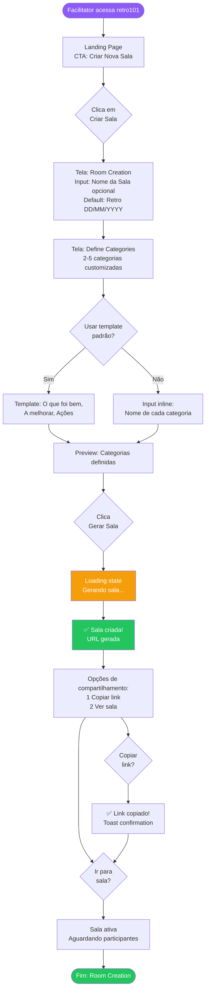
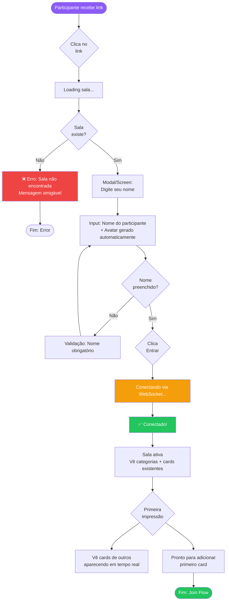

# UX Design Specification retro101

**Author:** Rspol
**Date:** 2025-12-30

---

<!-- UX design content will be appended sequentially through collaborative workflow steps -->

## Executive Summary

### Project Vision

**retro101** é uma ferramenta web minimalista projetada exclusivamente para facilitar retrospectivas ágeis através de simplicidade radical. Ao contrário de ferramentas genéricas de colaboração (como Miro) ou plataformas complexas de retrospectiva, o retro101 oferece apenas o essencial: criar salas, definir categorias personalizadas, compartilhar via link e permitir que toda a equipe adicione cards de forma colaborativa em tempo real.

O diferencial é o minimalismo intencional - uma interface que "desaparece" e permite que times foquem na retrospectiva em si, não na ferramenta. O objetivo é eliminar os 10-15 minutos de configuração típicos, reduzindo para menos de 60 segundos para facilitadores e menos de 30 segundos para participantes começarem a contribuir.

Como projeto de aprendizado, retro101 também serve para dominar o desenvolvimento de aplicações colaborativas em tempo real, incluindo WebSockets, sincronização de estado e arquitetura cliente-servidor.

### Target Users

**Facilitadores (Scrum Masters) - Persona: Marina**

Marina facilita 2-3 retrospectivas por sprint com diferentes squads. Seu maior desafio é a perda de tempo com configuração de ferramentas complexas - frequentemente gastando 10-15 minutos preparando quadros no Miro ou lutando com plataformas que têm centenas de features irrelevantes.

**Necessidades:**
- Criar sala completa (com categorias definidas) em menos de 60 segundos
- Controle simples sobre formato da retrospectiva (categorias personalizáveis)
- Focar em facilitar a discussão, não em gerenciar a ferramenta
- Compartilhar acesso instantaneamente via link

**Sucesso para Marina:**
Gastar 30 segundos preparando ao invés de 15 minutos, tendo mais tempo para preparar perguntas facilitadoras e conduzir discussões produtivas.

**Participantes (Membros do Time) - Persona: Rafael**

Rafael participa de retrospectivas quinzenais com seu squad. Ele valoriza simplicidade e não quer criar mais uma conta em mais uma ferramenta. Às vezes sente que interfaces complexas distraem do propósito da retrospectiva.

**Necessidades:**
- Entrar na sala e criar primeiro card em menos de 30 segundos
- Acesso sem fricção (sem cadastro, login ou onboarding complexo)
- Interface intuitiva que não precisa de tutorial
- Poder contribuir ativamente sem barreiras técnicas

**Sucesso para Rafael:**
Clicar no link, colocar nome, começar a adicionar cards imediatamente - focando na retrospectiva, não lutando com a ferramenta.

**Contexto de Uso:**
Times ágeis confortáveis com tecnologia, mas a interface deve ser autoexplicativa para todos os níveis. Uso primário em desktop (≥1024px) durante cerimônias remotas síncronas. Tablet e mobile são suporte secundário para casos específicos.

### Key Design Challenges

**1. Minimalismo Radical sem Parecer Incompleto**

O maior desafio de UX é criar uma interface tão simples que pareça "óbvia" e "perfeita", mas não "limitada" ou "incompleta". Cada elemento removido precisa ser uma decisão intencional que melhora a experiência, não uma carência percebida.

**Implicações de Design:**
- Comunicar qualidade através de design limpo e polido, não quantidade de features
- Resistir à tentação de adicionar "só mais uma opção"
- Fazer o essencial brilhar ao invés de esconder complexidade

**2. Tempo até Valor < 60 segundos (Facilitador) e < 30 segundos (Participante)**

Cada segundo importa. O fluxo de criação de sala até compartilhamento de link deve ser tão otimizado que facilitadores consigam preparar em menos de 60 segundos. Participantes devem entrar e criar primeiro card em menos de 30 segundos.

**Implicações de Design:**
- Zero fricção cognitiva: eliminar decisões desnecessárias
- Passos mínimos absolutos: cada tela tem um propósito único
- Valores padrão inteligentes quando possível
- Feedback visual instantâneo para cada ação

**3. Sincronização em Tempo Real Perceptível e Confiável**

Cards criados por um participante devem aparecer para todos os outros em menos de 500ms, criando sensação de colaboração viva e síncrona. Com 5-10 pessoas adicionando cards simultaneamente, a interface precisa comunicar claramente o que está acontecendo.

**Implicações de Design:**
- Optimistic updates: UI responde imediatamente antes de sincronização
- Feedback visual claro de estados (sincronizando, sincronizado, erro)
- Micro-interações que comunicam atividade sem distrair
- Clareza visual mesmo com múltiplos cards aparecendo simultaneamente

**4. Colaboração Multi-Usuário com Clareza Visual**

Quando 5-10 pessoas estão adicionando cards ao mesmo tempo, a interface precisa manter clareza organizacional. Cards precisam mostrar autoria, mas sem poluir visualmente. Categorias precisam ser evidentes mesmo com muitos cards.

**Implicações de Design:**
- Identificação de autoria clara mas discreta
- Organização visual por categoria que escala bem
- Layout que acomoda crescimento de conteúdo (até 50 cards típico)
- Hierarquia visual que mantém foco no conteúdo dos cards

### Design Opportunities

**1. "Interface que Desaparece" como Vantagem Competitiva**

Enquanto outras ferramentas competem adicionando features, retro101 compete removendo-as. A oportunidade é criar uma interface tão intuitiva e focada que literalmente "desaparece", permitindo que usuários foquem 100% na retrospectiva.

**Como Explorar:**
- Design minimalista e elegante que comunica qualidade
- Micro-interações sutis que guiam sem interferir
- Tipografia e espaçamento que criam respiração e foco
- Paleta de cores neutra que não distrai

**2. Onboarding Zero através de Design Autoexplicativo**

A oportunidade é criar uma experiência tão óbvia que nenhum usuário - facilitador ou participante - precise de tutorial, tooltips ou documentação. Cada tela tem um propósito cristalino comunicado através do design.

**Como Explorar:**
- Labels claros e diretos (sem jargão técnico)
- Affordances visuais óbvias (botões parecem clicáveis, inputs parecem editáveis)
- Fluxo linear sem bifurcações confusas
- Mensagens de estado em linguagem humana

**3. Feedback Visual Instantâneo que Celebra Colaboração**

Real-time collaboration é o coração do produto. A oportunidade é usar micro-interações e animações sutis para fazer a sincronização parecer mágica - cards aparecem suavemente, presença de outros usuários é celebrada, cada ação tem resposta visual imediata.

**Como Explorar:**
- Animações de entrada para novos cards (suaves, não intrusivas)
- Indicadores de presença de outros participantes
- Feedback tátil para ações (botões respondem ao hover/click)
- Estados de loading elegantes para momentos de espera

## Core User Experience

### Defining Experience

A experiência core do **retro101** é definida por duas jornadas complementares que convergem em uma única ação crítica: **colaboração em tempo real através de cards**.

**Jornada do Facilitador (Marina):**
O momento definidor é criar uma sala de retrospectiva completa em menos de 60 segundos - desde abrir o retro101 até compartilhar o link com o time. Esta jornada deve ser tão fluida e óbvia que Marina possa fazer enquanto inicia a call, sem planejamento prévio.

**Sequência ideal:**
1. Abrir retro101 → Ver "Criar Nova Sala" (decisão zero)
2. Definir 2-5 categorias → Nomes diretos, sem configurações extras
3. Receber link único → Copiar e compartilhar imediatamente
4. **Tempo total: 30-60 segundos**

**Jornada do Participante (Rafael):**
O momento definidor é clicar no link e criar o primeiro card em menos de 30 segundos. Esta jornada deve eliminar completamente a fricção de onboarding - sem cadastros, sem tutoriais, sem decisões complexas.

**Sequência ideal:**
1. Clicar link do Slack/Teams → Página da sala abre
2. Digite seu nome → Avatar gerado automaticamente
3. Ver categorias + criar primeiro card
4. **Tempo total: 10-30 segundos**

**Ação Core Compartilhada:**
Ambas as jornadas convergem na **criação e visualização de cards em tempo real**. Esta é a interação que acontece centenas de vezes durante uma retrospectiva e define o valor do produto. Deve ser:
- **Instantânea**: UI responde imediatamente (optimistic update)
- **Mágica**: Cards aparecem para todos em < 500ms
- **Óbvia**: Onde clicar, o que digitar, como funciona - tudo autoexplicativo
- **Confiável**: Sincronização consistente com 5-10 pessoas simultaneamente

### Platform Strategy

**retro101** é uma **Single Page Application (SPA)** web com foco primário em desktop.

**Decisões de Plataforma:**

**Web SPA (não app nativo):**
- **Justificativa**: Zero fricção de acesso - compartilhar link, abrir navegador, começar
- **Benefício**: Sem instalação, sem updates, sem app stores, sem barreiras
- **Trade-off**: Sem capacidades offline (aceitável - uso é síncrono durante cerimônias)

**Desktop-First (≥1024px):**
- **Justificativa**: Retrospectivas remotas acontecem em computadores durante calls
- **Design**: Multi-coluna para visualizar todas as categorias simultaneamente
- **Otimização**: Layout espaçoso, mouse/keyboard como primary input

**Suporte Secundário:**
- **Tablet (768-1023px)**: Layout adaptativo, touch-friendly, funcionalidade completa
- **Mobile (≥320px)**: Layout vertical, suporte básico para casos específicos

**Interação Primária:**
- **Mouse + Keyboard**: Hover states, keyboard navigation, click interactions
- **Touch**: Secundário em tablet/mobile com affordances apropriadas

**Tecnologia Real-Time:**
- **WebSockets**: Conexão persistente durante sessão da sala
- **Sincronização**: Bidirecional, < 500ms latency, reconexão automática
- **Estado**: Mantido no cliente para responsividade, sincronizado via backend

**Compatibilidade:**
- Últimas 2 versões de Chrome, Firefox, Safari, Edge
- Sem suporte IE ou navegadores antigos (permite usar APIs modernas)

### Effortless Interactions

O **retro101** transforma ações que normalmente exigem múltiplos passos em interações de um único movimento.

**1. Criação de Sala (Facilitador)**

**Interação tradicional (Miro):**
- Abrir Miro → Criar board → Escolher template → Configurar grid → Criar post-its → Escolher cores → Configurar permissões → Gerar link (10-15 minutos)

**Interação effortless (retro101):**
- Abrir retro101 → Clicar "Criar Nova Sala" → Definir categorias → Link gerado automaticamente (30-60 segundos)

**O que torna effortless:**
- Um único botão primário na home (decisão zero)
- Apenas informação essencial solicitada (nomes das categorias)
- Link gerado e pronto para copiar imediatamente
- Sem configurações, sem escolhas desnecessárias, sem steps extras

**2. Entrada na Sala (Participante)**

**Interação tradicional:**
- Receber link → Criar conta → Verificar email → Login → Aceitar permissões → Tutorial → Entrar na sala (5+ minutos)

**Interação effortless (retro101):**
- Clicar link → Digitar nome → Dentro (10-30 segundos)

**O que torna effortless:**
- Link leva direto para a sala específica (não homepage genérica)
- Zero cadastro ou autenticação (apenas identificação simples)
- Avatar gerado automaticamente (sem escolhas estéticas)
- Interface autoexplicativa (sem tutorial forçado)

**3. Criação de Cards (Todos)**

**Interação tradicional:**
- Encontrar ferramenta de post-it → Escolher cor → Escolher tamanho → Criar → Digitar texto → Posicionar manualmente → Configurar autoria

**Interação effortless (retro101):**
- Clicar categoria → Digitar texto → Enter (ou botão salvar) → Card aparece para todos

**O que torna effortless:**
- Ação direta: clicar onde quer adicionar
- Zero configuração: cor, tamanho, posição gerenciados automaticamente
- Autoria automática: nome do criador associado automaticamente
- Sincronização invisível: aparece para todos instantaneamente
- Optimistic update: UI responde antes mesmo de sincronização completa

**4. Compartilhamento de Link**

**Interação tradicional:**
- Encontrar opção de compartilhar → Configurar permissões → Gerar link → Copiar → Colar

**Interação effortless (retro101):**
- Link já está visível e pronto para copiar ao criar sala

**O que torna effortless:**
- Link gerado automaticamente na criação
- Botão "Copiar Link" em posição óbvia
- Feedback visual quando copiado
- Sem configuração de permissões (todos com link podem acessar)

### Critical Success Moments

Estes são os momentos make-or-break que determinam se usuários adotam ou abandonam o retro101.

**Momento 1: Primeiro Uso do Facilitador (Marina) - 30 segundos**

**O que acontece:**
Marina abre retro101 pela primeira vez 2 minutos antes da retrospectiva começar. Ela precisa criar sala, definir categorias e compartilhar link antes do time entrar na call.

**Sucesso parece:**
- Vê imediatamente "Criar Nova Sala" - clica sem hesitar
- Tela simples pede categorias - digita rapidamente "O que foi bem", "A melhorar", "Ações"
- Link aparece instantaneamente - copia e cola no Slack
- **30 segundos depois**: Time já está entrando na sala enquanto call começa

**Falha parece:**
- Interface confusa com múltiplas opções
- Formulário longo com campos desnecessários
- Precisa criar conta antes de continuar
- Link não é óbvio ou precisa configurar permissões
- **Resultado**: Marina desiste e volta para Miro

**Por que é crítico:**
Se Marina não conseguir criar sala em < 60s, ela não volta. A promessa de simplicidade precisa ser provada nos primeiros 30 segundos.

**Momento 2: Primeiro Uso do Participante (Rafael) - 10 segundos**

**O que acontece:**
Rafael clica no link que Marina compartilhou no Slack. Ele está no meio de uma tarefa e quer entrar rápido para contribuir sem perder contexto.

**Sucesso parece:**
- Link abre direto na sala (não homepage)
- Tela simples: "Qual seu nome?" - digita "Rafael"
- Imediatamente vê as categorias e pode criar card
- **10 segundos depois**: Já adicionou primeiro feedback

**Falha parece:**
- Link leva para página de cadastro
- Precisa criar senha, verificar email, aceitar termos
- Interface complexa com tutorial obrigatório
- Não fica claro onde adicionar cards
- **Resultado**: Rafael fica frustrado, contribui minimamente

**Por que é crítico:**
Times têm 5-10 participantes. Se apenas um sentir fricção, o feedback negativo contamina a percepção do grupo. Entrada precisa ser trivial.

**Momento 3: Primeira Sincronização em Tempo Real - 500ms**

**O que acontece:**
Rafael cria seu primeiro card. Marina e outros participantes estão assistindo a tela. O card de Rafael aparece instantaneamente para todos.

**Sucesso parece:**
- Rafael digita e clica salvar
- **Imediatamente** (< 100ms): Card aparece na tela de Rafael (optimistic update)
- **< 500ms**: Card aparece para Marina e todos os outros
- Animação suave de entrada (card "desliza" para posição)
- **Sensação**: "Wow, é realmente em tempo real!"

**Falha parece:**
- Rafael salva mas nada acontece imediatamente
- Loading spinner por 2-3 segundos
- Card aparece para outros com atraso de 3-5 segundos
- Ou pior: precisa refresh para ver cards novos
- **Sensação**: "Isso não é colaborativo, é só um formulário lento"

**Por que é crítico:**
Real-time collaboration é o diferencial do retro101. Se a sincronização não parecer mágica, o produto perde sua razão de existir.

**Momento 4: Retrospectiva Completa - 30-60 minutos**

**O que acontece:**
Time usa retro101 do início ao fim de uma retrospectiva completa. Todos criam cards, discutem, definem ações.

**Sucesso parece:**
- Sistema estável durante toda a cerimônia
- Cards aparecem consistentemente para todos
- Nenhum participante pede ajuda técnica
- Marina facilita discussão sem gerenciar ferramenta
- **Final**: "Isso foi simples, vamos usar na próxima"

**Falha parece:**
- Conexão cai no meio e não reconecta
- Cards duplicam ou somem aleatoriamente
- Performance degrada com muitos cards
- Participantes reportam bugs ou inconsistências
- **Final**: "Vamos voltar para o Miro"

**Por que é crítico:**
Uma retrospectiva bem-sucedida do início ao fim valida completamente o conceito. Uma falha técnica no meio destrói confiança e adoção futura.

### Experience Principles

Estes princípios guiam todas as decisões de UX design para o **retro101**.

**1. Simplicidade Radical Sobre Flexibilidade**

**Princípio:**
Quando em dúvida entre adicionar opção ou mantê-la simples, escolha simples. Cada feature, opção ou configuração adicional é uma falha de design até prova em contrário.

**Na Prática:**
- ❌ Permitir escolher cores de cards → ✅ Usar cor padrão harmoniosa
- ❌ Múltiplos templates → ✅ Apenas customizar categorias
- ❌ Configurar permissões → ✅ Link = acesso (simplicidade intencional)

**Por quê:**
Complexidade se acumula. Cada escolha adicional consome segundos e energia cognitiva. O diferencial do retro101 é não ter essas escolhas.

**2. Segundos Importam - Otimizar Tempo até Valor**

**Princípio:**
Cada segundo entre "abrir retro101" e "criar primeiro card" é um segundo desperdiçado. Eliminar passos desnecessários não é otimização prematura - é respeito pelo tempo do usuário.

**Na Prática:**
- Meta: Facilitador cria sala em < 60s (ideal: 30s)
- Meta: Participante cria primeiro card em < 30s (ideal: 10s)
- Zero passos extras: sem cadastro, sem configuração, sem onboarding
- Optimistic updates: UI responde antes de sincronização

**Por quê:**
O problema que resolvemos é "perder 10-15 minutos configurando". Se levarmos 5 minutos, falhamos. Velocidade é uma feature.

**3. Tecnologia Invisível - Interface que Desaparece**

**Princípio:**
A melhor UX é aquela que não é notada. Usuários devem pensar sobre a retrospectiva, não sobre como usar a ferramenta.

**Na Prática:**
- Sincronização acontece automaticamente (sem botão "refresh")
- Autoria de cards é automática (sem configurar quem criou)
- Links funcionam simplesmente (sem explicar como compartilhar)
- Layout adapta-se naturalmente (sem configurar view)

**Por quê:**
Ferramentas complexas forçam usuários a pensar sobre a ferramenta. Queremos que pensem sobre a retrospectiva.

**4. Auto-Explicativo por Design - Zero Curva de Aprendizado**

**Princípio:**
Se um usuário precisa de tutorial, tooltip ou documentação para executar ação core, o design falhou. Interface deve comunicar affordances através de design, não texto.

**Na Prática:**
- Botões parecem clicáveis (visual affordance)
- Labels são diretos: "Criar Nova Sala" não "New Board"
- Fluxo é linear: passo 1 → passo 2 → passo 3 (sem bifurcações)
- Estados são claros: salvando, salvo, erro (comunicação visual)

**Por quê:**
"Simplicidade" não é apenas ter poucas features - é ter features óbvias. Auto-explicativo elimina fricção cognitiva.

**5. Sincronização como Experiência - Real-Time é Delightful**

**Princípio:**
Real-time collaboration não é apenas requisito técnico - é oportunidade de criar experiência delightful. Sincronização deve parecer mágica, não mecânica.

**Na Prática:**
- Cards aparecem com animação suave (não pop abrupto)
- Feedback imediato com optimistic updates (responsividade percebida)
- Latência < 500ms cria sensação de simultaneidade genuína
- Presença de outros participantes é celebrada (avatars, indicadores)

**Por quê:**
O momento "wow" do retro101 é ver card aparecer instantaneamente para toda equipe. Este momento precisa ser polido e consistente.

## Desired Emotional Response

### Primary Emotional Goals

**retro101** tem um objetivo emocional duplo que define sua proposta de valor através de sentimentos:

**1. Alívio Imediato - Eliminação de Frustração**

Usuários devem sentir **alívio** quase instantâneo ao perceber que não haverá a fricção típica de ferramentas complexas.

**Para Facilitadores (Marina):**
- **Sensação**: "Ah, finalmente! Criei a sala em 30 segundos e já posso focar na retrospectiva."
- **Contraste emocional**: De ansiedade ("preciso preparar isso rápido") para alívio ("já está pronto, sem esforço")
- **Momento-chave**: Quando o link é gerado automaticamente e ela percebe que não há mais nada para configurar

**Para Participantes (Rafael):**
- **Sensação**: "Que bom, só preciso colocar meu nome e já estou dentro. Sem criar outra conta."
- **Contraste emocional**: De resistência ("mais uma ferramenta nova?") para alívio ("ah, é só isso mesmo")
- **Momento-chave**: Quando entra na sala em menos de 10 segundos e já vê as categorias prontas

**Por que alívio é crítico:**
O problema que resolvemos é frustração com complexidade. Alívio é a prova emocional imediata de que o problema foi resolvido.

**2. Confiança Crescente - Trust Composto ao Longo do Tempo**

Após o alívio inicial, usuários devem construir **confiança** progressiva de que o retro101 é confiável e preferível.

**Confiança Imediata (primeiros 60 segundos):**
- "Sei exatamente o que fazer" - Interface autoexplicativa
- "Isso vai funcionar" - Feedback visual claro e responsivo
- "Posso confiar nisso" - Sincronização acontece sem falhas

**Confiança Composta (durante a retrospectiva):**
- "Continua funcionando" - Sistema estável durante 30-60 minutos
- "É realmente em tempo real" - Cards aparecem instantaneamente toda vez
- "Posso focar no que importa" - Ferramenta não interrompe ou distrai

**Trust de Longo Prazo (segunda retrospectiva em diante):**
- "Vou escolher isso de novo" - Preferência ativa sobre alternativas
- "Recomendo para outros times" - Trust suficiente para advocacy
- "É minha ferramenta padrão" - Default mental estabelecido

**Por que confiança é crítica:**
Alívio traz a primeira tentativa. Confiança traz adoção recorrente e crescimento orgânico.

**Objetivo Emocional Terciário: Delight Através de Simplicidade**

Além de alívio e confiança, usuários devem experimentar **momentos de delight** quando percebem que sim, realmente é tão simples quanto parece.

**Momentos de Delight:**
- "Wait, isso é tudo?" - Quando percebem que não há steps extras
- "Wow, apareceu na hora!" - Primeira vez vendo card sincronizar em < 500ms
- "Nem precisei pensar" - Ao completar ação sem hesitação cognitiva
- "Isso é exatamente o que eu preciso" - Reconhecimento de fit perfeito com necessidade

### Emotional Journey Mapping

O retro101 cria uma jornada emocional específica que transforma ceticismo inicial em preferência ativa.

**Fase 1: Descoberta (Primeiros 30 segundos)**

**Facilitador (Marina):**
- **Início**: Ceticismo leve + Pressa ("Preciso preparar isso rápido, será que vai dar tempo?")
- **Durante**: Surpresa positiva ("Só preciso definir categorias? Sério?")
- **Final**: Alívio + Pequeno delight ("30 segundos e já está pronto! Isso é bom demais!")
- **Estado emocional resultante**: Confiança inicial + Curiosidade positiva

**Participante (Rafael):**
- **Início**: Resistência leve + Pressa ("Mais uma ferramenta? Vou perder tempo com isso...")
- **Durante**: Surpresa ("Só meu nome? Nada de criar conta?")
- **Final**: Alívio ("Já estou dentro, foi trivial")
- **Estado emocional resultante**: Receptividade + Atenção

**Fase 2: Primeiro Uso Core (Primeiros 5 minutos)**

**Criação do Primeiro Card:**
- **Antes**: Pequena hesitação ("Onde eu clico? Como faço?")
- **Durante**: Confiança crescente ("Ah, é óbvio - clico na categoria e digito")
- **Depois**: Accomplishment ("Criei! E apareceu para mim imediatamente")
- **Estado emocional**: Confiança estabelecida

**Primeira Sincronização Observada:**
- **Contexto**: Rafael acabou de criar card, Marina vê aparecer na tela dela
- **Emoção**: **Delight** ("Wow, realmente é em tempo real! Apareceu na hora!")
- **Impacto**: Validação emocional do valor core do produto
- **Estado resultante**: Enthusiasm + Engagement

**Fase 3: Uso Contínuo (Durante a Retrospectiva - 20-60 minutos)**

**Múltiplos Participantes Colaborando:**
- **Estado emocional dominante**: **Foco calmo** + Sense of flow
- **Sentimento**: "Esqueci da ferramenta, estou focado na discussão"
- **Ausência de emoções negativas**: Sem frustração, sem confusão, sem interrupções técnicas
- **Presença de emoção positiva sutil**: Satisfação contínua com facilidade de uso

**Quando Tudo Funciona Perfeitamente:**
- **Emoção**: Satisfação silenciosa ("Está funcionando, como deveria")
- **Importante**: Ausência de emoções negativas é sucesso - a ferramenta "desapareceu"

**Se Algo Der Errado (Conexão cai temporariamente):**
- **Emoção desejada**: Confiança na recuperação, não pânico
- **UX deve comunicar**: "Reconectando..." (calma, controle, transparência)
- **Após reconexão**: Alívio ("Voltou, não perdi nada")

**Fase 4: Conclusão (Final da Retrospectiva)**

**Facilitador (Marina):**
- **Emoção primária**: **Satisfação profunda** ("Conseguimos fazer uma retrospectiva completa sem problemas técnicos")
- **Emoção secundária**: **Appreciação** ("Ganhei 15 minutos que normalmente perderia configurando")
- **Pensamento resultante**: "Vou usar isso na próxima retrospectiva"

**Participante (Rafael):**
- **Emoção**: Satisfação leve ("Contribuí facilmente, sem fricção")
- **Ausência de emoção negativa**: Sem frustração residual com ferramenta
- **Associação mental**: retro101 = ferramenta que funciona simplesmente

**Fase 5: Retorno (Segunda Retrospectiva em Diante)**

**Facilitador:**
- **Emoção ao abrir**: **Familiaridade confortável** ("Sei exatamente o que fazer")
- **Confiança elevada**: "Vai funcionar como da última vez"
- **Preferência ativa**: Escolhe retro101 ao invés de considerar alternativas

**Participante:**
- **Reconhecimento**: "Ah, é o retro101 de novo!"
- **Expectativa positiva**: "Vai ser fácil como da última vez"
- **Sem resistência**: Aceita imediatamente ao invés de suspirar internamente

### Micro-Emotions

Pequenos estados emocionais que, em conjunto, criam a experiência emocional completa do retro101.

**1. Confiança vs. Confusão**

**Objetivo**: Usuários devem sentir **confiança constante** de que sabem o que fazer, nunca confusão.

**Onde aplicar:**
- **Criação de sala**: Labels claros ("Criar Nova Sala"), não jargão ("New Board", "Initialize Workspace")
- **Entrada na sala**: Pergunta direta ("Qual seu nome?"), não formulário complexo
- **Criação de cards**: Affordance visual óbvia (botão + visível, input clicável)

**Como medir sucesso:**
Nenhum usuário pergunta "Como eu faço X?" - porque é autoexplicativo.

**2. Trust vs. Skepticism**

**Objetivo**: Construir **trust** progressivo através de confiabilidade consistente, superando ceticismo inicial.

**Onde construir trust:**
- **Sincronização**: Funciona toda vez, sem falhas - build trust que "realmente é em tempo real"
- **Estabilidade**: Sistema não cai ou perde dados durante retrospectiva - trust que é confiável
- **Transparência**: Estados claros (salvando, salvo, erro) - trust através de honestidade

**Como medir sucesso:**
Usuários voltam a usar retro101 e recomendam para outros times - proof de trust estabelecido.

**3. Excitement vs. Anxiety**

**Objetivo**: Usuários devem sentir **leve excitement** ao ver sincronização funcionar, não ansiedade sobre complexidade.

**Excitement positivo:**
- Primeiro card sincronizando: "Wow, funciona!"
- Ver múltiplos cards aparecendo: "É colaborativo de verdade!"
- Completar retrospectiva sem bugs: "Isso foi suave!"

**Evitar anxiety:**
- Sem formulários intimidantes
- Sem decisões com consequências unclear
- Sem momentos de "E agora? Onde clico?"

**4. Accomplishment vs. Frustration**

**Objetivo**: Pequenos momentos de **accomplishment** durante toda a experiência, zero frustração.

**Micro-accomplishments:**
- Facilitador: "Criei a sala em 30s!" → Sentimento de eficiência
- Participante: "Entrei em 10s!" → Sentimento de facilidade
- Ambos: "Adicionei meu feedback!" → Sentimento de contribuição

**Evitar frustration:**
- Sem loading longo que frustra
- Sem erros obscuros que confundem
- Sem passos repetitivos que irritam

**5. Delight vs. Satisfaction**

**Objetivo**: Elevar alguns momentos de mera satisfaction para **delight** genuíno.

**Delight genuíno:**
- **Primeira sincronização**: Não apenas "funciona" (satisfaction), mas "Wow!" (delight)
- **Velocidade de setup**: Não apenas "foi rápido" (satisfaction), mas "Sério? Já?" (delight)
- **Ausência de fricção**: Não apenas "sem problemas" (satisfaction), mas "É tão simples!" (delight)

**Como criar delight:**
- Exceder expectativas levemente (ainda mais rápido que esperado)
- Micro-interações polidas (animações suaves, feedback tátil)
- Momentos de "magic" percebido (sincronização instantânea)

**6. Belonging vs. Isolation**

**Objetivo**: Participantes devem sentir **senso de presença coletiva**, não isolamento individual.

**Criar belonging:**
- Ver avatars de outros participantes (visual de presença)
- Cards aparecendo de múltiplas pessoas (evidência de colaboração)
- Sincronia da experiência (todos vendo mesma coisa ao mesmo tempo)

**Evitar isolation:**
- Não fazer parecer formulário solo onde você apenas submit dados
- Comunicar presença de outros através de design
- Celebrar ação coletiva, não apenas individual

### Design Implications

Como objetivos emocionais se traduzem em decisões concretas de UX design.

**1. Alívio → Minimalismo Radical no Onboarding**

**Objetivo Emocional:** Criar alívio imediato eliminando fricção de entrada.

**Implicações de Design:**
- **Zero passos desnecessários**: Sem cadastro, sem tutorial, sem configuração complexa
- **Valores padrão inteligentes**: Avatar gerado automaticamente, sem escolher cores
- **Clareza imediata**: Primeira tela tem um propósito óbvio (criar sala OU entrar com nome)
- **Feedback de progresso**: Usuário sempre sabe onde está no fluxo (mas fluxo é curtíssimo)

**Exemplo concreto:**
❌ "Bem-vindo! Crie sua conta → Verifique email → Configure perfil → Aceite termos → Entre na sala"
✅ "Qual seu nome? → [Digite] → Você está na sala"

**2. Confiança → Feedback Visual Claro e Consistente**

**Objetivo Emocional:** Build confiança através de previsibilidade e transparência.

**Implicações de Design:**
- **Estados visuais claros**: Loading, sucesso, erro - sempre comunicados visualmente
- **Optimistic updates**: UI responde imediatamente antes de sincronização (confiança na responsividade)
- **Affordances óbvias**: Botões parecem clicáveis, inputs parecem editáveis
- **Mensagens em linguagem humana**: "Salvando seu card..." não "Processing request..."

**Exemplo concreto:**
Quando Rafael cria card:
1. Clica em categoria → Input aparece imediatamente (responsivo)
2. Digita texto → Caracteres aparecem sem lag (confiança)
3. Clica "Salvar" → Card aparece instantaneamente na tela dele (optimistic update)
4. Micro-feedback: Card tem leve animação "confirmado" quando sincroniza com backend

**3. Delight → Micro-Interações e Animações Polidas**

**Objetivo Emocional:** Criar momentos de delight através de polish sutil.

**Implicações de Design:**
- **Animações suaves**: Cards aparecem com fade-in ou slide elegante, não pop abrupto
- **Feedback tátil**: Botões respondem ao hover com transição suave
- **Surpresa positiva**: Sincronização tão rápida que surpreende
- **Atenção a detalhes**: Typography, spacing, cores - tudo comunica qualidade

**Exemplo concreto:**
Card criado por outro usuário:
- Aparece com animação suave de fade-in + leve bounce (300ms)
- Posiciona-se automaticamente na categoria certa
- Mostra nome do autor com tipografia clara mas discreta
- **Sensação**: "Wow, isso é polido!" (delight através de qualidade percebida)

**4. Trust → Estabilidade e Tratamento de Erros Gracioso**

**Objetivo Emocional:** Build trust através de confiabilidade e honestidade quando algo falha.

**Implicações de Design:**
- **Testes de confiabilidade**: Sistema deve funcionar consistentemente com 5-10 usuários
- **Reconexão automática**: Se WebSocket cair, tenta reconectar sem exigir refresh manual
- **Mensagens de erro honestas**: "Conexão perdida. Tentando reconectar..." (transparência)
- **Degradação graciosa**: Se sincronização falha, sistema não crasha - comunica o problema

**Exemplo concreto:**
Se conexão cair:
- Banner discreto aparece: "Reconectando... " (não modal que bloqueia uso)
- Sistema continua tentando em background (5 tentativas antes de desistir)
- Se sucesso: Banner vira "Reconectado! " por 2s e some (alívio)
- Se falha: "Não foi possível reconectar. Por favor, recarregue a página." (honestidade)

**5. Foco Calmo → Interface que Desaparece**

**Objetivo Emocional:** Permitir foco calmo na retrospectiva através de design invisível.

**Implicações de Design:**
- **Paleta neutra**: Cores que não distraem (cinzas, brancos, um accent suave)
- **Typography legível**: Foco no conteúdo dos cards, não em decoração
- **Espaço em branco generoso**: Respiração visual, sem poluição
- **Hierarquia clara**: O que é importante (cards) se destaca, o que é secundário (UI) recua

**Exemplo concreto:**
Sala durante retrospectiva:
- Categorias claramente separadas mas não competindo por atenção
- Cards em primeiro plano visual (contraste, tamanho)
- Controls secundários (copiar link, sair) discretos mas acessíveis
- **Sensação**: "Estou vendo os cards da retrospectiva, não lutando com interface"

### Emotional Design Principles

Princípios que guiam como criar experiência emocional desejada em cada decisão de design.

**Princípio 1: Alívio Através de Subtração, Não Adição**

**Princípio:**
Cada elemento removido da interface cria alívio. Cada elemento adicionado exige justificativa emocional.

**Aplicação:**
- Remover campo desnecessário = alívio de não ter que preencher
- Remover decisão desnecessária = alívio de não ter que escolher
- Remover step desnecessário = alívio de chegar mais rápido ao objetivo

**Teste de validação:**
"Se remover isso, o usuário vai sentir falta ou vai sentir alívio?" Se alívio → remova.

**Princípio 2: Confiança Através de Previsibilidade e Consistência**

**Princípio:**
Usuários ganham confiança quando a interface se comporta de forma previsível e consistente toda vez.

**Aplicação:**
- Mesma ação sempre produz mesmo resultado (previsibilidade)
- Elementos semelhantes se comportam de forma semelhante (consistência)
- Estados visuais comunicam status de forma uniforme (padrão estabelecido)

**Teste de validação:**
"Se o usuário fizer X, ele consegue prever o que vai acontecer?" Se sim → confiança estabelecida.

**Princípio 3: Delight Através de Exceder Expectativas Sutilmente**

**Princípio:**
Delight vem de exceder expectativas levemente, não de adicionar features desnecessárias.

**Aplicação:**
- Sincronização em 300ms quando usuário espera 500ms = delight sutil
- Setup em 20s quando usuário espera 60s = delight percebido
- Animação polida quando usuário não espera animação = delight através de qualidade

**Teste de validação:**
"Isso supera a expectativa do usuário de forma positiva e sutil?" Se sim → cria delight.

**Princípio 4: Trust Através de Transparência nos Momentos Críticos**

**Princípio:**
Trust se constrói sendo honesto sobre o que está acontecendo, especialmente quando algo está errado.

**Aplicação:**
- Mostrar "Salvando..." quando salvando (transparência)
- Mostrar "Reconectando..." quando perdeu conexão (honestidade)
- Mostrar erro específico quando algo falha (respeito pela inteligência do usuário)

**Teste de validação:**
"O usuário entende o que está acontecendo agora?" Se sim → trust building.

**Princípio 5: Foco Através de Hierarquia Visual Clara**

**Princípio:**
Usuários conseguem focar no que importa quando design estabelece hierarquia visual óbvia.

**Aplicação:**
- Conteúdo (cards) = primeiro plano visual (contraste, tamanho, cor)
- Estrutura (categorias) = segundo plano (organização clara mas discreta)
- Controls (botões secundários) = terceiro plano (acessíveis mas não competindo)

**Teste de validação:**
"O usuário consegue focar no conteúdo principal sem distração?" Se sim → hierarquia efetiva.

## UX Pattern Analysis & Inspiration

### Inspiring Products Analysis

Para informar o design do **retro101**, analisamos produtos que exemplificam excelência em colaboração em tempo real e/ou minimalismo radical - os dois pilares da experiência desejada.

**1. Slack - Colaboração em Tempo Real Exemplar**

**O que fazem bem:**
- **Real-time messaging instantâneo**: Mensagens aparecem para todos imediatamente (<100ms perceived latency)
- **Presença visual**: Indicadores de quem está online/ativo são discretos mas sempre visíveis
- **Onboarding simples**: Entrar em workspace via link, não cadastro complexo
- **Typing indicators**: Mostram quando alguém está digitando - cria sensação de presença viva
- **Thread organization**: Hierarquia visual clara mantém conversas organizadas mesmo com volume alto

**Por que é relevante para retro101:**
Slack prova que colaboração síncrona pode parecer mágica quando a latência é imperceptível. Retro101 precisa atingir o mesmo nível de "instantaneidade percebida" para cards.

**Padrões transferíveis:**
- **Optimistic updates**: Mensagem aparece imediatamente para remetente antes de sincronizar
- **Presença discreta**: Avatars/indicadores de quem está ativo sem poluir interface
- **Link-based access**: Entrar em workspace via URL, não cadastro obrigatório

**2. Google Docs - Compartilhamento Sem Fricção**

**O que fazem bem:**
- **Zero-friction sharing**: "Compartilhar" gera link, qualquer pessoa com link pode acessar
- **Real-time collaborative editing**: Múltiplos cursores, edições aparecem instantaneamente
- **Presença nomeada**: Cursores coloridos com nomes dos colaboradores
- **Auto-save transparente**: Nunca pede para salvar, sempre sincronizado
- **Comentários contextuais**: Feedback inline sem poluir documento

**Por que é relevante para retro101:**
Google Docs resolveu compartilhamento colaborativo de forma definitiva: link = acesso. Retro101 deve adotar o mesmo modelo para salas.

**Padrões transferíveis:**
- **Link = Access**: URL da sala funciona como chave de acesso, sem configurar permissões
- **Named presence**: Mostrar quem criou cada card (equivalente a cursores nomeados)
- **Auto-sync**: Cards salvam automaticamente, sem botão "salvar" manual
- **Visual feedback de colaboração**: Mostrar quando outros estão adicionando cards

**3. Linear - Minimalismo Radical em Produtividade**

**O que fazem bem:**
- **Interface ultra-limpa**: Cada pixel serve um propósito, zero decoração desnecessária
- **Keyboard-first**: Toda ação tem atalho, poder users trabalham sem mouse
- **Performance obsessiva**: Transições instantâneas, zero lag perceptível
- **Typography e spacing**: Hierarquia clara através de tipografia, não cores chamativas
- **Estados claros**: Loading, sucesso, erro - sempre comunicados com clareza visual

**Por que é relevante para retro101:**
Linear prova que minimalismo radical não significa "incompleto" - significa "perfeitamente editado". Cada feature que existe está polida ao máximo.

**Padrões transferíveis:**
- **Paleta neutra**: Cinzas, brancos, um accent color - foco no conteúdo
- **Hierarquia tipográfica**: Tamanhos e pesos de fonte criam organização, não cores
- **Performance como feature**: Velocidade é UX - otimizar até parecer instantâneo
- **Micro-interações sutis**: Transições suaves, não animações exageradas

**4. Figma - Colaboração Multi-Usuário Delightful**

**O que fazem bem:**
- **Cursores nomeados em tempo real**: Ver onde cada pessoa está trabalhando
- **Commenting contextual**: Comentários ancorados em elementos específicos
- **Presença celebrada**: Avatars dos colaboradores visíveis, dando sensação de "juntos"
- **Conflict resolution elegante**: Múltiplas pessoas editando mesma área sem chaos
- **Onboarding progressivo**: Core features óbvias, features avançadas descobríveis

**Por que é relevante para retro101:**
Figma mostra como fazer colaboração multi-usuário parecer delightful, não caótica. Com 5-10 pessoas adicionando cards, precisamos da mesma clareza visual.

**Padrões transferíveis:**
- **Visual de presença**: Mostrar avatars de participantes ativos na sala
- **Activity indicators**: Sinalizar quando novos cards estão sendo adicionados
- **Contextual ownership**: Cada card mostra claramente quem criou
- **Graceful multi-user**: Sistema funciona bem com 10 pessoas simultâneas, não apenas 2

### Transferable UX Patterns

Padrões extraídos dos produtos inspiradores que se aplicam diretamente aos desafios de UX do retro101.

**Padrão 1: Link-Based Zero-Friction Access**

**Fonte:** Google Docs, Slack workspaces

**O Padrão:**
Compartilhar = gerar URL único. Qualquer pessoa com URL pode acessar. Zero cadastro, zero configuração de permissões, zero fricção.

**Aplicação no retro101:**
- Facilitador cria sala → URL único gerado automaticamente
- Facilitador compartilha URL no Slack/Teams
- Participantes clicam → entram direto na sala (apenas nome, sem conta)
- Modelo de permissão: "todos com link podem colaborar"

**Por que funciona:**
Elimina completamente fricção de acesso. URL = chave de entrada. Simples, óbvio, zero decisões.

**Padrão 2: Optimistic Updates para Responsividade Percebida**

**Fonte:** Slack, Linear, Figma

**O Padrão:**
Quando usuário faz ação (enviar mensagem, criar objeto), UI responde instantaneamente mostrando resultado ANTES de sincronização com backend completar.

**Aplicação no retro101:**
- Participante digita card e clica "Criar"
- **Imediatamente** (< 100ms): Card aparece na tela do participante
- **Background** (< 500ms): Card sincroniza com backend e aparece para outros
- Se sincronização falha: Card mostra estado de erro, permite retry

**Por que funciona:**
Cria sensação de "instantaneidade" mesmo com latência de rede. Usuário nunca espera - ação tem resposta imediata.

**Padrão 3: Named Presence Indicators**

**Fonte:** Google Docs (cursores nomeados), Figma (avatars colaboradores)

**O Padrão:**
Mostrar visualmente quem está presente e ativo, com identificação clara (nome, avatar, cor).

**Aplicação no retro101:**
- **Na entrada**: Lista de participantes ativos (avatars + nomes) em área discreta
- **Nos cards**: Nome do autor mostrado claramente mas sem poluir
- **Em tempo real**: Quando novo participante entra, avatar aparece na lista
- **Quando sai**: Avatar fica translúcido ou é removido

**Por que funciona:**
Cria sensação de "estar junto" mesmo remotamente. Presença visual combate isolamento, reforça que é colaboração real.

**Padrão 4: Auto-Save com Feedback Visual**

**Fonte:** Google Docs ("Salvando..." → "Todas as alterações salvas")

**O Padrão:**
Sistema salva automaticamente, sem botão "salvar" manual. Feedback visual discreto comunica status de sincronização.

**Aplicação no retro101:**
- Cards são salvos automaticamente ao serem criados
- **Estado 1**: "Salvando..." (ícone de loading discreto)
- **Estado 2**: Confirmado (ícone de check sutil, depois desaparece)
- **Estado 3**: Erro (ícone de alerta, permite retry manual)
- Sem botão "Salvar" explícito - acontece automaticamente

**Por que funciona:**
Elimina passo manual (lembrar de salvar). Feedback visual build trust que dados estão seguros.

**Padrão 5: Minimalismo através de Hierarquia Tipográfica**

**Fonte:** Linear, Notion

**O Padrão:**
Criar organização visual e hierarquia através de tipografia (tamanhos, pesos, espaçamento), não através de cores chamativas ou bordas pesadas.

**Aplicação no retro101:**
- **Categorias**: Fonte maior, peso semi-bold, spacing generoso
- **Cards**: Fonte normal, legível, foco no conteúdo do texto
- **Metadados** (autor, timestamp): Fonte menor, peso lighter, cor mais suave
- **Paleta**: Cinzas e brancos dominam, um accent color para ações primárias

**Por que funciona:**
Minimalismo visual não significa "sem estrutura" - significa estrutura através de design sutil, não decoração pesada.

**Padrão 6: Performance-as-Experience**

**Fonte:** Linear (velocidade obsessiva)

**O Padrão:**
Tratar velocidade e responsividade não como requisito técnico, mas como parte core da experiência do usuário. Otimizar até parecer instantâneo.

**Aplicação no retro101:**
- **Carregamento de sala**: < 2s para estar pronto para usar
- **Criação de card**: < 100ms feedback visual, < 500ms sincronização
- **Animações**: 200-300ms (rápidas o suficiente para não atrasar, suaves o suficiente para não parecer abrupto)
- **Transitions**: CSS transitions aceleradas por GPU

**Por que funciona:**
Velocidade é uma feature que users sentem em cada interação. Responsividade percebida build confiança e delight.

### Anti-Patterns to Avoid

Padrões UX comuns que devemos conscientemente evitar, baseados em análise de produtos problemáticos e feedback de usuários.

**Anti-Pattern 1: Onboarding Forçado e Complexo**

**O Problema:**
Muitas ferramentas forçam tutorial/walkthrough na primeira vez, bloqueando uso até concluir. Adiciona fricção enorme para usuários experientes que só querem "começar a usar".

**Exemplos negativos:**
- Ferramentas que exigem assistir vídeo de 5 minutos antes de usar
- Tooltips obrigatórias que aparecem sequencialmente
- "Tours guiados" que não podem ser pulados

**Por que evitar:**
Conflita diretamente com objetivo de "tempo até valor < 60s". Onboarding forçado adiciona 5-10 minutos de fricção pura.

**Alternativa para retro101:**
- **Zero onboarding**: Interface autoexplicativa by design
- **Progressive disclosure**: Features avançadas descobríveis, não escondidas nem forçadas
- **Help contextual opcional**: Disponível se needed, nunca obrigatória

**Anti-Pattern 2: Feature Bloat e Opções Desnecessárias**

**O Problema:**
Adicionar features "porque sim" ou "porque competidores têm". Cada feature adiciona complexidade cognitiva, mesmo que seja "opcional".

**Exemplos negativos:**
- Miro: 50+ shapes, cores infinitas, templates demais
- Ferramentas de retro com gamification, analytics, voting, todos habilitados por default
- Configurações com 20+ toggles para "customizar experiência"

**Por que evitar:**
Retro101 compete através de simplicidade, não complexidade. Cada feature não-essencial dilui o valor core.

**Alternativa para retro101:**
- **Princípio de subtração**: Cada feature proposta é rejeitada até provar essencialidade
- **MVP radical**: Apenas categorias customizáveis + cards - nada mais no V1
- **Resistir pressão de paridade**: "Competidor X tem Y" não é justificativa suficiente

**Anti-Pattern 3: Sincronização Lenta ou Unreliable**

**O Problema:**
Real-time collaboration que não é realmente "real-time". Lag de 3-5s entre ação e sincronização. Ou pior: precisa refresh para ver updates.

**Exemplos negativos:**
- Ferramentas que exigem F5 para ver novos cards
- Sincronização com lag perceptível (> 1s)
- Conflitos de edição frequentes sem resolution

**Por que evitar:**
Real-time é o diferencial core do retro101. Se sincronização não parecer mágica, produto perde razão de existir.

**Alternativa para retro101:**
- **Latência < 500ms** como requisito não-negociável
- **WebSockets** persistente, não polling
- **Optimistic updates** para responsividade percebida
- **Reconexão automática** se connection drop

**Anti-Pattern 4: Estados Unclear e Loading sem Feedback**

**O Problema:**
Usuário faz ação e não sabe se funcionou. Loading sem indicador. Erros sem mensagem clara. Sistema em estado ambíguo.

**Exemplos negativos:**
- Clicar "Salvar" → nada acontece → não sabe se salvou
- Loading infinito sem indicação de progresso
- Erro genérico: "Algo deu errado" (sem detalhes)

**Por que evitar:**
Estados unclear destroem confiança. Usuários não sabem se podem confiar no sistema.

**Alternativa para retro101:**
- **Estados sempre claros**: Idle → Loading → Success/Error
- **Feedback visual imediato**: Toda ação tem resposta visual (< 100ms)
- **Mensagens em linguagem humana**: "Salvando seu card..." "Reconectando..." "Não foi possível salvar. Tente novamente."
- **Graceful degradation**: Se algo falha, comunica claramente o que aconteceu

**Anti-Pattern 5: Design Visual Chamativo que Distrai**

**O Problema:**
Usar cores vibrantes, gradientes, sombras pesadas, animações exageradas para "parecer moderno". Acaba distraindo do conteúdo.

**Exemplos negativos:**
- Fundos com gradientes coloridos que competem com conteúdo
- Animações exageradas (500ms+ de duration, bounces dramáticos)
- Cores saturadas em todos os elementos
- Ícones decorativos que não agregam significado

**Por que evitar:**
Retro101 quer que interface "desapareça". Design chamativo força atenção na ferramenta, não na retrospectiva.

**Alternativa para retro101:**
- **Paleta neutra**: Cinzas, brancos, um accent suave
- **Animações sutis**: 200-300ms, easing natural, não bounce dramático
- **Flat design**: Sombras mínimas, apenas para hierarquia necessária
- **Ícones funcionais**: Apenas quando agregam clareza, não decoração

**Anti-Pattern 6: Assumir Expertise do Usuário**

**O Problema:**
Interface que assume todos users são power users. Atalhos de teclado sem descoberta. Jargão técnico. Features escondidas sem affordance.

**Exemplos negativos:**
- Atalhos críticos sem hints (Ctrl+K para buscar, mas não há indicação)
- Labels técnicos: "Initialize workspace" ao invés de "Criar sala"
- Features importantes apenas acessíveis via menu escondido

**Por que evitar:**
Retro101 precisa ser óbvio para TODOS participantes, incluindo POs, designers, stakeholders não-técnicos.

**Alternativa para retro101:**
- **Labels em português simples**: "Criar Nova Sala" não "New Board"
- **Affordances visuais óbvias**: Botões parecem clicáveis, inputs parecem editáveis
- **Atalhos como enhancement**: Disponíveis para poder users, mas não necessários
- **Zero jargão técnico**: Linguagem humana, não tech speak

### Design Inspiration Strategy

Estratégia clara de como usar (e não usar) inspiração de outros produtos para informar decisões de design do retro101.

**What to Adopt Directly:**

**1. Link-Based Access Model (Google Docs)**

**Decisão:** Adotar completamente.

**Implementação:**
- Facilitador cria sala → URL único gerado
- Compartilhar URL = dar acesso
- Participantes clicam link → entram direto (apenas nome)
- Sem sistema de permissões complexo - link = acesso

**Justificativa:**
Google Docs provou que este modelo funciona perfeitamente. Reinventar seria desperdiçar tempo. Copiar diretamente.

**2. Optimistic Updates Pattern (Slack, Linear)**

**Decisão:** Adotar como princípio core.

**Implementação:**
- Toda ação do usuário tem resposta visual instantânea (< 100ms)
- Card aparece na UI do criador antes de sincronizar com backend
- Background: sincronização real acontece em < 500ms
- Se falha: rollback visual + mensagem de erro

**Justificativa:**
Responsividade percebida é crítica para sentir "instantaneidade". Pattern provado em múltiplos produtos.

**3. Minimal Palette com Hierarquia Tipográfica (Linear)**

**Decisão:** Adotar filosofia visual.

**Implementação:**
- Paleta: Cinzas (vários tons), branco, um accent color (azul ou verde suave)
- Hierarquia através de font size, weight, spacing
- Flat design, sombras mínimas
- Foco no conteúdo (cards), não decoração

**Justificativa:**
Linear prova que minimalismo visual comunica qualidade. Alinha perfeitamente com objetivo de "interface que desaparece".

**What to Adapt for Our Context:**

**1. Named Presence Indicators (Google Docs, Figma)**

**Inspiração:** Cursores nomeados, avatars de colaboradores.

**Adaptação para retro101:**
- **Não precisamos**: Cursores em tempo real (overkill para cards)
- **Precisamos**: Lista de participantes ativos (avatars + nomes)
- **Precisamos**: Autoria clara em cada card

**Implementação adaptada:**
- Header discreto mostra avatars de participantes ativos
- Cards mostram nome do autor (tipografia menor, cor suave)
- Quando novo participante entra, avatar aparece com micro-animação

**Por que adaptar:**
Contexto é diferente de edição de documento. Não precisa cursores em tempo real, mas precisa senso de "quem está aqui".

**2. Auto-Save com Feedback (Google Docs)**

**Inspiração:** "Salvando..." → "Todas as alterações salvas no Drive"

**Adaptação para retro101:**
- **Não precisamos**: Feedback persistente de "salvo" (distrai)
- **Precisamos**: Feedback transitório de estados

**Implementação adaptada:**
- Criar card → Optimistic update (aparece imediatamente)
- Micro-feedback: Ícone sutil de "sincronizando" por 200ms
- Se sucesso: Ícone desaparece (sucesso é default)
- Se erro: Mensagem clara + opção de retry

**Por que adaptar:**
Contexto de retro101 é sessão temporária (30-60min), não documento persistente. Feedback pode ser mais transitório.

**3. Keyboard Shortcuts (Linear)**

**Inspiração:** Toda ação tem atalho, interface keyboard-first.

**Adaptação para retro101:**
- **Não adotar**: Keyboard-first como primary model (maioria users usa mouse)
- **Adotar parcialmente**: Atalhos para ações frequentes como enhancement

**Implementação adaptada:**
- Enter = Criar card (quando em input)
- Esc = Cancelar criação de card
- Ctrl/Cmd + C = Copiar link da sala (quando em focus)
- **Mas:** Mouse/click é primary interaction model

**Por que adaptar:**
Linear é ferramenta para desenvolvedores power users. Retro101 é para times diversos - precisa ser óbvio com mouse primeiro, atalhos como bonus.

**What to Avoid Completely:**

**1. Gamification e Badges (Retrium, FunRetro)**

**O que é:** Points, badges, achievements para "engajar" usuários.

**Por que evitar:**
- Adiciona complexidade visual e cognitiva
- Distrai do propósito core (retrospectiva)
- Conflita com objetivo de minimalismo radical
- Não resolve problema real (fricção de setup)

**Decisão:** Resistir completamente a qualquer gamification.

**2. Complex Permission Systems (Miro, Figma Enterprise)**

**O que é:** Roles (viewer, editor, admin), permissões granulares, configuração de quem pode fazer o quê.

**Por que evitar:**
- Adiciona fricção enorme ao setup (decidir permissões)
- Overkill para sessão temporária de retrospectiva
- Conflita com objetivo de "tempo até valor < 60s"

**Decisão:** Link = acesso total. Simplicidade radical sobre flexibilidade.

**3. Rich Text Formatting em Cards (Notion, Coda)**

**O que é:** Bold, italic, links, mentions, emoji picker, etc em texto de cards.

**Por que evitar:**
- Adiciona UI complexity (toolbar de formatting)
- 95% dos cards são texto plain simple
- Retorno marginal vs complexidade adicionada

**Decisão MVP:** Plain text apenas. Avalisar rich text em versão futura SE houver demanda real.

**4. Templates Pré-Definidos (Retrium, EasyRetro)**

**O que é:** Biblioteca de formatos de retrospectiva (Starfish, 4Ls, Mad-Sad-Glad).

**Por que evitar no MVP:**
- Adiciona decisão (qual template escolher?)
- Customização via categorias já resolve problema
- Pode adicionar em V2, mas não é essencial para MVP

**Decisão:** Não incluir templates no MVP. Categorias customizáveis são suficientes.

**Implementation Guardrails:**

Para manter foco e evitar mission creep durante implementação:

**Regra 1: Burden of Proof Invertido**

Default é "não adicionar". Cada feature proposta precisa justificar:
- Resolve problema real dos usuários-alvo (Marina e Rafael)?
- Não pode ser resolvido de forma mais simples?
- Vale a complexidade adicional?

**Regra 2: Pattern Adoption Checklist**

Antes de adotar pattern de produto inspirador, perguntar:
- ✅ Resolve nosso problema específico?
- ✅ Funciona no nosso contexto (sessão temporária, não produto persistente)?
- ✅ Alinha com princípios de experiência (simplicidade, velocidade, invisibilidade)?
- ✅ Não adiciona complexidade desnecessária?

Se qualquer resposta é "não", adaptar ou rejeitar.

**Regra 3: MVP Scope Discipline**

Features explicitamente fora do MVP (resistir tentação):
- ❌ Anonimidade
- ❌ Votação/priorização
- ❌ Templates
- ❌ Rich text formatting
- ❌ Edição/exclusão de cards
- ❌ Histórico de retrospectivas
- ❌ Exportação

Avaliar para V2 após validar que MVP resolve problema core.

## Design System Foundation

### Design System Choice

**retro101** utilizará **Tailwind CSS** como foundation de design system, complementado por **Shadcn/ui** para componentes base acessíveis.

**Stack de Design:**
```
Frontend Framework: React
└─ Tailwind CSS (utility-first styling)
   └─ Shadcn/ui (accessible unstyled components)
      └─ Custom components (Room, Cards, Categories)
```

**Abordagem:**
Utility-first CSS que fornece controle total sobre design minimal sem impor design language predefinido. Shadcn/ui fornece componentes acessíveis (Button, Input, Modal) que copiamos e customizamos completamente no projeto.

### Rationale for Selection

**1. Alinhamento com Minimalismo Radical**

Tailwind não impõe estética predefinida - fornece building blocks (utility classes) para construir exatamente o design desejado. Para atingir visual minimal inspirado em Linear (paleta neutra, hierarquia tipográfica, flat design), Tailwind dá controle total sem lutar contra defaults opinativos de sistemas como Material UI ou Ant Design.

**Por que isso importa:**
Retro101 compete através de simplicidade visual. Sistemas como MUI ou Chakra têm design language próprio que precisaríamos "des-estilizar" - desperdiçando tempo overriding defaults. Tailwind parte do zero, permitindo construir apenas o necessário.

**2. Velocidade sem Sacrificar Controle**

**Velocidade:**
- Utility classes aceleram desenvolvimento (sem escrever CSS custom para cada elemento)
- Shadcn/ui fornece componentes acessíveis prontos que customizamos
- Tailwind IntelliSense autocompleta classes no editor

**Controle:**
- Cada classe é explícita e visível no JSX
- Sem "magic" de CSS-in-JS ou styled-components
- Fácil debugar: vê exatamente quais classes aplicadas

**Balanço ideal:**
Mais rápido que CSS custom do zero, mais controle que bibliotecas opinativas como MUI.

**3. Performance e Bundle Size**

**PurgeCSS Automático:**
- Tailwind remove automaticamente classes não usadas em produção
- Bundle final contém apenas CSS realmente utilizado
- Tipicamente 10-20KB gzipped (vs 100-300KB de bibliotecas completas)

**Alinhamento com Princípios:**
- "Performance como Feature" - Bundle pequeno = loading rápido
- "Velocidade é UX" - Menos KB = menos latência percebida

**4. Design Tokens Centralizados**

Tailwind config serve como single source of truth para design tokens:

```js
// tailwind.config.js
module.exports = {
  theme: {
    colors: {
      // Paleta Neutra
      background: '#ffffff',
      foreground: '#0a0a0a',
      muted: '#fafafa',
      'muted-foreground': '#737373',
      border: '#e5e5e5',

      // Accent Color
      primary: '#3b82f6',
      'primary-hover': '#2563eb',
    },
    fontFamily: {
      sans: ['Inter', 'system-ui', 'sans-serif'],
    },
    fontSize: {
      'category-header': ['1.125rem', { lineHeight: '1.75rem', fontWeight: '600' }],
      'card-content': ['0.875rem', { lineHeight: '1.25rem', fontWeight: '400' }],
      'card-author': ['0.75rem', { lineHeight: '1rem', fontWeight: '400' }],
    },
    spacing: {
      'card-padding': '1rem',
      'category-gap': '1.5rem',
      'layout-padding': '2rem',
    },
  },
}
```

**Benefício:**
Mudanças na paleta de cores ou tipografia acontecem em um lugar. Consistência garantida por design.

**5. Comunidade e Recursos**

**Tailwind:**
- Documentação excepcional (searchable, com exemplos)
- Comunidade gigante (soluções para qualquer problema)
- Tailwind UI (componentes premium opcionais se precisar acelerar)
- Ativamente mantido e evoluindo

**Shadcn/ui:**
- Crescendo rapidamente (adotado por muitos projetos modernos)
- Componentes acessíveis (Radix UI primitives)
- Você "owns" o código (copy/paste, não dependency)
- Exemplos de uso com Tailwind

**6. Evita Lock-in de Biblioteca**

**Shadcn/ui não é dependency:**
- Você copia componentes para seu projeto
- Componentes são **seu código**, não biblioteca externa
- Pode modificar livremente sem break changes de updates

**Vantagem:**
Controle total. Se precisar mudar abordagem futuramente, componentes são seus.

### Implementation Approach

**Phase 1: Foundation Setup (Semana 1)**

**1.1 Install Tailwind CSS**
```bash
npm install -D tailwindcss postcss autoprefixer
npx tailwindcss init -p
```

**1.2 Configure Design Tokens**

Definir tokens no `tailwind.config.js`:
- **Colors**: Paleta neutra (grays) + primary accent
- **Typography**: Font family, sizes, weights, line-heights
- **Spacing**: Escala consistente (4px base)
- **Border Radius**: Minimal (2px ou 4px)
- **Shadows**: Sutis para hierarquia

**1.3 Setup Shadcn/ui**
```bash
npx shadcn-ui@latest init
```

Configurar para usar Tailwind config existente.

**Phase 2: Core Components (Semana 2-3)**

Construir componentes específicos do retro101:

**2.1 Card Component**
```jsx
// components/ui/retro-card.jsx
// - Plain text content area
// - Author badge (nome + avatar)
// - Subtle shadow para depth
// - Hover state discreto
```

**Princípios de design:**
- Background branco, border sutil
- Typography: card-content size (0.875rem)
- Padding: card-padding (1rem)
- Shadow: sutil (apenas para separar do background)

**2.2 Category Column**
```jsx
// components/category-column.jsx
// - Header com nome da categoria
// - Grid para cards
// - "Add Card" button integrado
```

**Princípios de design:**
- Header: category-header font size, semi-bold
- Spacing: category-gap entre cards
- Flex/grid layout para cards

**2.3 Participant Avatars**
```jsx
// components/participant-avatar.jsx
// - Circular avatar com initials
// - Color coding por participante
// - Tooltip com nome completo (hover)
```

**Princípios de design:**
- 32px ou 40px diameter
- Background color único por participante (gerado de nome)
- Initials centralizadas, branco sobre fundo colorido

**2.4 Room Creation Form**
```jsx
// components/create-room-form.jsx
// - Input para nome das categorias
// - Primary button para criar
// - Link preview após criação
```

**Princípios de design:**
- Input clean (Shadcn/ui Input como base)
- Button primary (accent color, hover state)
- Minimal form layout

**Phase 3: Polish & Refinement (Semana 4)**

**3.1 Micro-Interactions**
- Hover states para cards (subtle elevation change)
- Button hover (primary-hover color)
- Input focus (border accent)
- Transitions suaves (200-300ms)

**3.2 Animações de Entrada**
- Cards aparecem com fade-in + slide-up sutil
- Participant avatars aparecem com scale animation
- Durações: 200-300ms (rápido mas perceptível)

**3.3 Responsive Behavior**
- Desktop (≥1024px): Multi-column layout para categorias
- Tablet (768-1023px): 2 colunas ou scroll horizontal
- Mobile (≥320px): Single column, stack vertical

### Customization Strategy

**Design Tokens a Customizar:**

**1. Color Palette - Minimal Grayscale**

```js
colors: {
  // Backgrounds
  background: '#ffffff',      // Main background
  muted: '#fafafa',          // Secondary background

  // Foregrounds
  foreground: '#0a0a0a',     // Primary text
  'muted-foreground': '#737373', // Secondary text

  // Borders
  border: '#e5e5e5',         // Default border

  // Accent (único color)
  primary: '#3b82f6',        // Primary actions
  'primary-hover': '#2563eb', // Hover state
  'primary-foreground': '#ffffff', // Text on primary

  // States
  destructive: '#ef4444',    // Errors, delete
  success: '#10b981',        // Success states
}
```

**Filosofia:**
Grayscale domina (90%), accent color usado apenas em ações primárias (10%). Minimalismo através de restrição de paleta.

**2. Typography - Hierarquia Clara**

```js
fontFamily: {
  sans: ['Inter', 'system-ui', 'Segoe UI', 'sans-serif'],
},
fontSize: {
  // Headers
  'page-title': ['1.5rem', { lineHeight: '2rem', fontWeight: '700' }],
  'category-header': ['1.125rem', { lineHeight: '1.75rem', fontWeight: '600' }],

  // Body
  'card-content': ['0.875rem', { lineHeight: '1.25rem', fontWeight: '400' }],
  'body': ['0.875rem', { lineHeight: '1.5rem', fontWeight: '400' }],

  // Small
  'card-author': ['0.75rem', { lineHeight: '1rem', fontWeight: '400' }],
  'caption': ['0.75rem', { lineHeight: '1rem', fontWeight: '400' }],
}
```

**Escolha de fonte:**
- **Inter**: Modern, legível, gratuita, excelente para UI
- **Fallbacks**: system-ui garante performance se Inter não carregar

**3. Spacing - Escala Consistente**

```js
spacing: {
  // Component-specific
  'card-padding': '1rem',      // 16px
  'category-gap': '1.5rem',    // 24px
  'layout-padding': '2rem',    // 32px

  // Mantém escala default do Tailwind (4px base)
  // 0, 0.5, 1, 2, 3, 4, 5, 6, 8, 10, 12, 16, 20, 24...
}
```

**4. Border Radius - Minimal**

```js
borderRadius: {
  'none': '0',
  'sm': '0.25rem',   // 4px - buttons, inputs
  'md': '0.375rem',  // 6px - cards
  'lg': '0.5rem',    // 8px - modals
  'full': '9999px',  // avatars
}
```

**Filosofia:**
Pequenos radius (4-6px) para suavidade sutil, mas não exagerado. Flat design, não iOS-style rounded.

**5. Shadows - Subtis**

```js
boxShadow: {
  'sm': '0 1px 2px 0 rgba(0, 0, 0, 0.05)',
  'DEFAULT': '0 1px 3px 0 rgba(0, 0, 0, 0.1)',
  'md': '0 4px 6px -1px rgba(0, 0, 0, 0.1)',
  // Sem lg, xl, 2xl - desnecessários para design minimal
}
```

**Uso:**
- Cards: shadow-sm ou shadow (apenas para hierarquia)
- Modals/Dropdowns: shadow-md
- Nunca sombras dramáticas - conflita com flat aesthetic

**Componentes do Shadcn/ui a Usar:**

**Base Components (copiar e customizar):**
- ✅ **Button** - Primary, secondary, ghost variants
- ✅ **Input** - Text input para categorias, cards
- ✅ **Dialog** - Modals se necessário
- ✅ **Tooltip** - Participant names on hover
- ✅ **Avatar** - Participant avatars

**Componentes a NÃO usar (overkill para MVP):**
- ❌ Dropdown menus complexos
- ❌ Data tables
- ❌ Charts
- ❌ Calendars
- ❌ Rich text editors

**Customização dos Componentes:**

Shadcn/ui componentes são copiados para `components/ui/`. Customizar:

**Button:**
```jsx
// components/ui/button.jsx
// Variants:
// - default: primary color, usado para "Criar Sala", "Adicionar Card"
// - ghost: transparent, usado para actions secundárias
// - destructive: red, usado se adicionar delete (não no MVP)
```

**Input:**
```jsx
// components/ui/input.jsx
// Customize:
// - Border: border color from tokens
// - Focus: primary accent ring
// - Placeholder: muted-foreground color
```

**Princípios de Customização:**

**1. Menos é Mais**
- Remover variantes não usadas dos componentes Shadcn
- Manter apenas default, ghost no Button
- Simplificar ao invés de adicionar opções

**2. Consistência com Tokens**
- Sempre usar cores dos tokens, nunca hardcode
- Sempre usar spacing scale, nunca valores arbitrários
- Sempre usar font sizes definidos

**3. Acessibilidade Mantida**
- Shadcn/ui já traz ARIA attributes
- Manter keyboard navigation
- Manter focus states visíveis

**Guidelines de Implementação:**

**DOs:**
- ✅ Use utility classes diretamente no JSX
- ✅ Defina tokens no tailwind.config
- ✅ Customize Shadcn components copiados
- ✅ Mantenha consistência visual através de tokens
- ✅ PurgeCSS automaticamente em build

**DON'Ts:**
- ❌ Não escreva CSS custom (use utilities)
- ❌ Não hardcode cores/spacing (use tokens)
- ❌ Não adicione componentes Shadcn desnecessários
- ❌ Não override Tailwind classes com !important
- ❌ Não adicione animações exageradas

## 2. Core User Experience

### 2.1 Defining Experience

**A experiência definidora do retro101:**

> **"Criar um card e vê-lo aparecer instantaneamente para toda a equipe."**

Quando alguém descrever o retro101 para um colega, dirá: *"É tipo Google Docs para retrospectivas - todo mundo pode adicionar cards ao mesmo tempo e todos veem na hora."*

**Por que essa é a experiência definidora:**

1. **Momento de Sucesso**: O usuário sente que está realmente colaborando quando vê o card aparecer instantaneamente (não "enviado", mas **ali, agora**)
2. **Diferencial Técnico**: É onde a tecnologia (WebSockets, sincronização em tempo real) se torna invisível e mágica
3. **Emoção Core**: Relief ("não preciso esperar, atualizar, ou me preocupar") + Delight ("uau, é tão rápido!")
4. **Fluxo Natural**: Se essa interação funciona perfeitamente, toda a retrospectiva flui sem fricção

**Comparação com produtos famosos:**

- **Tinder**: "Deslize para dar match" → **retro101**: "Digite e veja aparecer para todos"
- **Google Docs**: "Edite junto em tempo real" → **retro101**: "Crie cards junto em tempo real"
- **Slack**: "Mensagem enviada e vista instantaneamente" → **retro101**: "Card criado e visto instantaneamente"

### 2.2 User Mental Model

**Como usuários pensam sobre criar cards em retrospectivas:**

**Mental Model Atual (Mundo Físico):**

- **Post-it físico**: Pegar nota adesiva → Escrever → Colar no quadro → Todos veem
- **Expectativa**: Imediatismo, tangibilidade, visibilidade instantânea
- **Problema com ferramentas digitais**: Muitos passos entre "pensei" e "está lá"

**Mental Model Digital (Ferramentas Existentes):**

- **Miro/Mural**: Arrastar elemento → Duplo clique → Escrever → Clicar fora → Formatar → Ajustar posição
- **Google Forms**: Preencher campo → Clicar "Enviar" → Aguardar confirmação → Não ver resultados dos outros em tempo real
- **Slack/Chat**: Escrever mensagem → Enter → Aparece para todos (modelo **mais próximo** do ideal)

**Mental Model Ideal para retro101:**

```
Pensamento → Clique em categoria → Digitar → Enter → Card aparece (para mim E para todos)
                                                       ↓
                                              "Pronto, próximo!"
```

**Expectativas dos Usuários:**

1. **Velocidade**: "Deve ser tão rápido quanto enviar uma mensagem no Slack"
2. **Simplicidade**: "Sem formatação, sem configuração - só escrever e pronto"
3. **Visibilidade**: "Se eu criei, todos viram - não preciso confirmar ou perguntar"
4. **Fluidez**: "Posso criar vários cards seguidos sem interrupção"

**Pontos de Confusão Potenciais:**

- ❌ "Preciso clicar em 'Salvar' ou 'Enviar'?" → ✅ Enter = salvar (como chat)
- ❌ "Onde fica o botão de adicionar card?" → ✅ Sempre visível em cada categoria
- ❌ "Meu card foi salvo?" → ✅ Feedback visual instantâneo (animação, confirmação)
- ❌ "Os outros estão vendo?" → ✅ Avatar/nome mostra quem criou (prova social)

### 2.3 Success Criteria

**Critérios de sucesso para a experiência de criar cards:**

**Performance (Tempo):**

- ⚡ **< 100ms**: Card aparece na minha tela (update otimista local)
- ⚡ **< 200ms**: Card aparece nas telas dos outros (sincronização WebSocket)
- ⚡ **< 500ms**: Confirmação do servidor (persistência garantida)

**Usabilidade (Clareza):**

- ✅ **Zero dúvida sobre onde clicar**: Botão "+ Add card" sempre visível em cada categoria
- ✅ **Zero dúvida sobre como salvar**: Enter ou click fora = salvar (padrões universais)
- ✅ **Zero ansiedade sobre status**: Feedback visual claro (loading, sucesso, erro)

**Feedback (Confiança):**

- 💬 **Visual instantâneo**: Card aparece com animação suave (fade-in/slide-in)
- 💬 **Confirmação implícita**: Presença do card na categoria = sucesso
- 💬 **Erro explícito**: Se falhar, mensagem clara + opção de retry
- 💬 **Contexto social**: Ver avatar/nome do autor = "alguém criou isso agora"

**Emotional Success Indicators:**

Usuário sente que teve sucesso quando:

1. **"Isso simplesmente funciona"** - Sem pensar, sem esforço, sem fricção
2. **"Estou colaborando de verdade"** - Vê cards dos outros aparecendo enquanto cria os seus
3. **"Posso focar no conteúdo"** - A ferramenta desaparece, só fica a retrospectiva
4. **"É tão rápido quanto pensar"** - Fluxo ininterrupto de pensamento → card → pensamento → card

**Failure Indicators (O que evitar):**

- ❌ Usuário hesita antes de clicar (UI confusa)
- ❌ Usuário pergunta "foi salvo?" (falta de feedback)
- ❌ Usuário espera > 1 segundo vendo loading (muito lento)
- ❌ Usuário precisa atualizar página para ver cards dos outros (não é tempo real)

### 2.4 Novel UX Patterns

**Pattern Analysis: Estabelecido + Refinado**

A experiência de criar cards no retro101 **NÃO requer padrões novos** - usamos padrões estabelecidos e provados:

**Padrões Estabelecidos que Adotamos:**

1. **Chat-like Input (Slack, WhatsApp, iMessage)**
   - Caixa de texto sempre visível
   - Enter para enviar
   - Mensagem aparece instantaneamente
   - Feedback implícito (mensagem = sucesso)
   - **Vantagem**: Zero curva de aprendizado - todos sabem usar chat

2. **Optimistic Updates (Google Docs, Figma, Linear)**
   - Ação aparece imediatamente na UI local
   - Sincronização acontece em background
   - Rollback só se servidor rejeitar
   - **Vantagem**: Sensação de velocidade instantânea

3. **Inline Creation (Notion, Trello, Asana)**
   - Criar novo item diretamente na lista/coluna
   - Sem modal, sem popup, sem tela separada
   - Contexto preservado durante criação
   - **Vantagem**: Fluxo ininterrupto, sem quebras de atenção

**Nosso Twist Único (Inovação Dentro de Padrões Familiares):**

```
Chat Input + Optimistic Updates + Inline Creation + Minimalismo Extremo
    ↓
Experiência de card creation mais rápida e simples que qualquer ferramenta de retro existente
```

**Específico para retro101:**

- **Sem formatação**: Apenas texto plano (vs Miro que permite cores, tamanhos, ícones)
- **Sem arraste**: Cards ficam onde foram criados (vs Mural que exige posicionamento manual)
- **Sem edição**: Cards são imutáveis após criação no MVP (vs ferramentas complexas)
- **Contexto de categoria**: Card criado já está na categoria certa (vs "criar depois categorizar")

**Por que NÃO Inovar:**

Usuários fazendo retrospectiva querem:

1. **Velocidade** → Padrões conhecidos são mais rápidos de usar
2. **Confiabilidade** → Padrões testados têm menos bugs/surpresas
3. **Foco** → Padrões familiares não exigem atenção cognitiva
4. **Inclusão** → Todos no time já conhecem esses padrões (chat, docs)

**Metáfora para Usuários:**

> "É como mandar mensagem num grupo do WhatsApp, mas cada 'categoria' da retrospectiva é um grupo diferente, e todo mundo vê tudo ao mesmo tempo."

### 2.5 Experience Mechanics

**Detalhamento passo-a-passo da experiência de criar card:**

---

#### **1. INITIATION (Como começar)**

**Trigger Visual:**

- Cada categoria tem botão **"+ Adicionar card"** sempre visível no topo/bottom da coluna
- Botão em estado idle: cinza claro, texto discreto
- Botão em hover: background muda, cursor pointer, micro-feedback

**Alternativa (Quick Action):**

- Clicar em espaço vazio dentro da categoria abre input inline
- Atalho de teclado: `N` (New card) quando foco está na categoria

**Estado Inicial:**

```
┌─────────────────────────┐
│  O que foi bem          │ ← Categoria header
├─────────────────────────┤
│                         │
│  [+ Adicionar card]     │ ← Botão de criação
│                         │
└─────────────────────────┘
```

**User Action:**

- Usuário clica no botão "+ Adicionar card"
- Sistema responde em **< 50ms**: botão desaparece, input inline aparece

---

#### **2. INTERACTION (O que o usuário faz)**

**Input State:**

```
┌─────────────────────────┐
│  O que foi bem          │
├─────────────────────────┤
│ ┌─────────────────────┐ │
│ │ Digite aqui...      │ │ ← Input com foco automático
│ │ [Autor: Marina]     │ │ ← Contexto do autor
│ └─────────────────────┘ │
│                         │
│  [Cards existentes]     │
└─────────────────────────┘
```

**Interaction Details:**

1. **Foco Automático**: Cursor já está no input (não precisa clicar novamente)
2. **Placeholder**: "Digite sua observação..." (contexto claro)
3. **Autor Visível**: Nome/avatar mostra quem está criando (transparência)
4. **Multi-linha**: Input expande automaticamente se texto for longo (até limite razoável)
5. **Character Count**: Limite de 280 caracteres (como tweet) - contador só aparece em 90%

**User Types:**

- Texto aparece em tempo real (sem lag)
- Input não trava, não stutters
- Backspace/Delete funcionam perfeitamente

**Real-time Indicator (Para Outros Usuários):**

```
Enquanto Marina digita, outros usuários veem:

┌─────────────────────────┐
│  O que foi bem          │
├─────────────────────────┤
│ ┌─────────────────────┐ │
│ │ Marina está digitan │ │ ← Indicador suave (opcional MVP)
│ │ do...               │ │
│ └─────────────────────┘ │
└─────────────────────────┘
```

*Nota: "Typing indicator" pode ser **pós-MVP** - não essencial, mas delightful*

---

#### **3. FEEDBACK (Como saber que está funcionando)**

**Ao Salvar (Enter ou Click Fora):**

**Step 3.1 - Optimistic Update (Local, < 100ms):**

```
┌─────────────────────────┐
│  O que foi bem          │
├─────────────────────────┤
│ ┌─────────────────────┐ │
│ │ Deploy sem erro!    │ │ ← Card aparece IMEDIATAMENTE
│ │ Marina · agora      │ │
│ └─────────────────────┘ │ ← Animação: slide-in de cima
│                         │
│  [+ Adicionar card]     │ ← Input resetado, pronto para próximo
└─────────────────────────┘
```

**Visual Feedback:**

- ✅ **Animação de entrada**: Card faz slide-in ou fade-in (150ms)
- ✅ **Posição**: Card aparece no topo da categoria (mais recente primeiro)
- ✅ **Autor**: Nome/avatar claramente visível
- ✅ **Timestamp**: "agora", "1min", "5min" (relativo, como redes sociais)

**Step 3.2 - Server Confirmation (< 200ms):**

- Card recebe ID único do servidor
- Pequeno indicador muda de "pending" para "confirmed" (sutil, pode ser cor ou ícone)
- Se falhar: Aparecer banner de erro + opção "Tentar novamente"

**Para Outros Usuários (< 200ms da criação):**

```
Rafael vê na tela dele:

┌─────────────────────────┐
│  O que foi bem          │
├─────────────────────────┤
│ ┌─────────────────────┐ │ ← Novo card aparece com animação
│ │ Deploy sem erro!    │ │
│ │ Marina · agora      │ │ ← Nome deixa claro quem criou
│ └─────────────────────┘ │
│                         │
│  [Cards anteriores]     │
└─────────────────────────┘
```

**Feedback Sonoro (Opcional):**

- Som suave quando card de outro usuário aparece (pode ser toggle on/off)
- Ajuda percepção de colaboração em tempo real
- **Pós-MVP** - não essencial

---

#### **4. COMPLETION (Como saber que terminou)**

**Successful Outcome:**

- ✅ Card salvo e visível para todos
- ✅ Input resetado, pronto para próximo card
- ✅ Foco retorna ao botão "+ Adicionar card" (ou permanece no input para criação sequencial rápida)
- ✅ Usuário pode imediatamente criar outro card ou navegar para outra categoria

**Completion States:**

1. **Single Card Creation**: Usuário criou um card → foco sai do input → pode fazer outra ação
2. **Rapid Card Creation**: Usuário criou card → pressiona Enter novamente → novo input aparece (fluxo contínuo para dumping rápido de ideias)
3. **Error Recovery**: Se falha → mensagem clara + botão "Tentar novamente" preserva o texto

**What's Next:**

Após criar card, usuário naturalmente:

- Cria outro card na mesma categoria (fluxo contínuo)
- Navega para outra categoria (Tab ou click)
- Lê cards dos outros (scroll, observação passiva)
- Volta a participar da discussão facilitada (foco na retrospectiva, não na ferramenta)

**Success Moment:**

> **Usuário pensa**: "Pronto! Próximo." (não "será que salvou?", não "preciso fazer mais alguma coisa?")

---

**Resumo da Mecânica Completa:**

```
INITIATION          INTERACTION         FEEDBACK            COMPLETION
    ↓                   ↓                   ↓                   ↓
Clique em         Digite texto        Card aparece        Pronto para
"+ Add card"      no input            instantaneamente    próximo card
  (< 50ms)          inline              (< 100ms local,       ou ação
                  com foco             < 200ms remoto)
                  automático
```

**Tempo Total (Percebido pelo Usuário):**

- **Pensei no feedback** → 0ms
- **Cliquei para criar** → 50ms (input aparece)
- **Digitei o texto** → variável (usuário controla)
- **Pressionei Enter** → 100ms (card aparece)
- **Total de fricção técnica**: **~150ms** (imperceptível, feels instant)

## Visual Design Foundation

### Color System

**Filosofia de Cores:**

O retro101 adota uma **paleta minimalista e intencional** que reforça os princípios de simplicidade radical e foco no conteúdo. As cores servem para orientar, não para decorar.

**Base Palette (Neutrals):**

```css
/* Tailwind neutral scale */
Backgrounds:
- neutral-50:  #fafafa (page background)
- white:       #ffffff (cards, inputs, elevated surfaces)

Text:
- neutral-900: #171717 (headings, primary content)
- neutral-700: #404040 (body text, card content)
- neutral-500: #737373 (meta information, timestamps)

Borders & Dividers:
- neutral-200: #e5e5e5 (subtle borders, card outlines)
- neutral-300: #d4d4d4 (defined borders, separators)
```

**Accent Color (Primary):**

```css
Blue (Confiança + Clareza):
- blue-600: #2563eb (primary actions, links, focus)
- blue-500: #3b82f6 (hover states)
- blue-700: #1d4ed8 (active/pressed states)
```

**Rationale:** Blue transmite profissionalismo e confiança sem ser agressivo. É universalmente compreendido como "ação" em interfaces.

**Semantic Colors:**

```css
Success: green-500 #22c55e (confirmações, operações bem-sucedidas)
Error:   red-500   #ef4444 (erros, validações falhadas)
Warning: amber-500 #f59e0b (avisos, limites)
Info:    blue-400  #60a5fa (tooltips, informações auxiliares)
```

**Category Colors (Diferenciação Visual):**

Cada categoria de retrospectiva recebe uma cor distinta apenas no header para facilitar identificação visual:

```css
Categoria 1: violet-500  #8b5cf6
Categoria 2: cyan-500    #06b6d4
Categoria 3: rose-500    #f43f5e
Categoria 4: amber-500   #f59e0b
Categoria 5: emerald-500 #10b981
```

**Uso:** Apenas em `border-l-4` no category header. O resto da interface permanece neutro.

**Accessibility:**

- Todos os pares texto/background atendem **WCAG AAA** (contraste ≥7:1)
- neutral-900 on white: 21:1
- neutral-700 on white: 10.4:1
- blue-600 on white: 8.6:1

### Typography System

**Primary Typeface: Inter**

**Rationale:**
- Tipografia humanista moderna com altíssima legibilidade em telas
- Extensa família de pesos (400, 500, 600, 700)
- Otimizada para interfaces de usuário
- Gratuita via Google Fonts

**Font Stack:**
```css
font-family: 'Inter', -apple-system, BlinkMacSystemFont, 'Segoe UI', Roboto, sans-serif;
```

**Type Scale & Hierarchy:**

```css
/* Display (uso raro) */
.text-4xl { font-size: 36px; line-height: 1.1; font-weight: 700; }
Uso: Hero sections, mensagens críticas

/* Headings */
.text-2xl { font-size: 24px; line-height: 1.25; font-weight: 700; }
Uso: H1 - Títulos de página ("Criar Nova Sala")

.text-xl { font-size: 20px; line-height: 1.375; font-weight: 600; }
Uso: H2 - Seções dentro de páginas

.text-lg { font-size: 18px; line-height: 1.5; font-weight: 600; }
Uso: H3 - Category headers, subtítulos

/* Body */
.text-base { font-size: 16px; line-height: 1.625; font-weight: 400; }
Uso: Card content, texto de formulários, conteúdo principal

.text-sm { font-size: 14px; line-height: 1.5; font-weight: 400; }
Uso: Labels, botões, meta info

.text-xs { font-size: 12px; line-height: 1.35; font-weight: 400; }
Uso: Timestamps, card author, tooltips
```

**Typography Principles:**

1. **Hierarchy Clara**: Salto perceptível entre níveis (mínimo 2px de diferença)
2. **Legibilidade First**: `leading-relaxed` (1.625) para conteúdo de cards (leitura confortável)
3. **Economia de Pesos**: Apenas 3 pesos (400 normal, 600 semibold, 700 bold)
4. **Consistência**: Cada tipo de conteúdo tem exatamente um estilo

**Font Weights Usage:**

```css
font-normal (400):  Body text, card content, inputs
font-semibold (600): H2, H3, category headers, labels
font-bold (700):     H1, botões primários, display
```

### Spacing & Layout Foundation

**Base Unit: 4px** (Tailwind default spacing scale)

**Spacing Scale:**

```css
spacing-1  = 4px   → Tight internal spacing
spacing-2  = 8px   → Component padding (small)
spacing-3  = 12px  → Small gaps, card spacing
spacing-4  = 16px  → Card padding, comfortable spacing
spacing-6  = 24px  → Category gaps, section spacing
spacing-8  = 32px  → Layout padding, major sections
spacing-10 = 40px  → Page margins
spacing-12 = 48px  → Large section breaks
```

**Component Spacing Specifications:**

**Cards:**
```css
Padding:  p-4 (16px) - confortável para leitura
Gap entre cards: gap-3 (12px) - clara distinção
Border: 1px solid neutral-200
Radius: rounded-md (6px)
Shadow: shadow-sm (sutil)
```

**Categories (Colunas):**
```css
Gap entre categorias: gap-6 (24px) - separação visual clara
Category padding: p-4 (16px)
Header padding: px-4 py-3 (16px horiz, 12px vert)
Header border-left: border-l-4 (cor da categoria)
Min width: 280px
```

**Page Layout:**
```css
Container padding: p-8 (32px) - breathing room em desktop
Max width: max-w-7xl (1280px) - otimizado para desktop
Grid de categorias:
  display: grid
  grid-template-columns: repeat(auto-fit, minmax(280px, 1fr))
  gap: 24px
```

**Layout Principles:**

1. **Múltiplos de 4**: Todo spacing é múltiplo de 4px (consistência matemática)
2. **Densidade Moderada**: Equilibra espaço disponível (desktop) com eficiência
3. **Whitespace Intencional**: Espaço negativo usado para criar grupos visuais
4. **Grid Flexível**: Categorias se adaptam ao viewport (2-5 colunas dependendo do espaço)

**Structural Layout:**

```
┌─────────────────────────────────────────────────────┐
│  [32px padding]                                      │
│                                                      │
│  ┌────────────────────────────────────────────┐    │
│  │  Content (max-w-7xl = 1280px)              │    │
│  │                                             │    │
│  │  [Categories Grid]                         │    │
│  │  ┌──────┐  ┌──────┐  ┌──────┐  ┌──────┐  │    │
│  │  │ Cat1 │  │ Cat2 │  │ Cat3 │  │ Cat4 │  │    │
│  │  │ 280+ │  │ 280+ │  │ 280+ │  │ 280+ │  │    │
│  │  └──────┘  └──────┘  └──────┘  └──────┘  │    │
│  │     ←───────── 24px gap ─────────→        │    │
│  └────────────────────────────────────────────┘    │
│                                                      │
└─────────────────────────────────────────────────────┘
```

### Accessibility Considerations

**Color Contrast:**

✅ **WCAG AAA Compliance** (mínimo 7:1 para texto normal, 4.5:1 para texto grande):

- `neutral-900` on `white`: **21:1** (exceptional)
- `neutral-700` on `white`: **10.4:1** (AAA)
- `blue-600` on `white`: **8.6:1** (AAA)
- Small text (12px, 14px): sempre `neutral-700` ou mais escuro

**Focus Indicators:**

```css
Todos elementos interativos:
focus:ring-2 focus:ring-blue-500 focus:ring-offset-2
focus:outline-none
```

- Anel de foco 2px com offset 2px (total 4px de indicação)
- Cor blue-500 para alta visibilidade
- Navegação por teclado sempre tem indicador claro

**Font Size Minimums:**

- Body text: **16px mínimo** (WCAG recomendação)
- Interactive elements: **14px mínimo**
- Meta info: 12px (aceitável para informação secundária, não para ações)

**Interactive Targets:**

- Botões: mínimo `py-2 px-4` (~40px height) - fácil de clicar
- Cards: se clicáveis, área completa é target (não só ícone)
- Links: padding adequado para evitar cliques acidentais

**Keyboard Navigation:**

- Ordem lógica de tabs (top-to-bottom, left-to-right)
- Todos os inputs acessíveis via Tab
- Enter/Space para ativar botões
- Esc para fechar modals/popups

**Semantic HTML:**

- Headings hierárquicos (h1 → h2 → h3, sem pular níveis)
- Landmarks: `<header>`, `<main>`, `<section>` para navegação por screen readers
- Form labels sempre associados a inputs via `for`/`id`
- Buttons semânticos (`<button>`, não `<div onclick>`)

**Motion & Animation:**

- Respeitar `prefers-reduced-motion` media query
- Animações sutis (150ms) para feedback
- Sem autoplay, sem loops infinitos
- Transições apenas para comunicar estado (não decorativas)

## Design Direction Decision

### Design Directions Explored

Durante a fase de exploração visual, foram criadas **6 variações de design** aplicando a fundação visual estabelecida (cores, tipografia, spacing) em diferentes abordagens:

1. **Ultra-Minimal** - Interface quase invisível, minimalismo extremo com categorias marcadas apenas por bordas coloridas sutis
2. **Structured Clarity** - Estrutura clara com bordas e separadores definidos em todos os elementos
3. **Soft Elevation** - Profundidade através de sombras suaves, elementos "flutuando" sobre o background
4. **Dense & Efficient** - Máxima densidade de informação com padding reduzido e spacing compacto
5. **Spacious & Calm** - Whitespace generoso, respiração visual ampla, sensação de calma
6. **Vibrant Categories** - Cores de categorias presentes e vibrantes, headers coloridos com identidade visual forte

Cada direção foi implementada em um showcase HTML interativo permitindo exploração visual completa e comparação lado a lado.

### Chosen Direction

**Direção Escolhida: Vibrant Categories (#6)**

**Características da Direção:**

- **Category Headers**: Background colorido (violet-500, cyan-500, rose-500, amber-500, emerald-500)
- **Category Containers**: Bordas coloridas (2px solid) correspondentes à cor do header
- **Cards**: Permanecem neutros (white background, border neutral-200) para manter foco no conteúdo
- **Add Card Button**: Bordas tracejadas (2px dashed) na cor da categoria
- **Visual Hierarchy**: Categorias visualmente distintas, cards limpos e focados em conteúdo

**Aplicação da Fundação Visual:**

```css
Categories:
- Headers: cor de fundo vibrante + texto branco + font-weight 700
- Borders: 2px solid na cor da categoria
- Background: white (cards area)

Cards:
- Background: white
- Border: 1px solid neutral-200
- Padding: 16px (p-4)
- Radius: 6px (rounded-md)
- Text: neutral-700 (body), neutral-500 (author/timestamp)

Buttons:
- Add card: 2px dashed border na cor da categoria
- Hover: background neutro claro (fafafa)
```

### Design Rationale

**Por que Vibrant Categories é a escolha certa para retro101:**

**1. Clareza Funcional > Minimalismo Absoluto**

Embora o produto tenha "minimalismo radical" como princípio, a escolha de Vibrant Categories prioriza **usabilidade sobre purismo estético**:

- Em retrospectivas com 3-5 categorias simultâneas, diferenciação visual **clara** é mais importante que interface "invisível"
- Cores vibrantes nos headers funcionam como **affordance visual** - usuário identifica instantaneamente onde adicionar cada tipo de feedback
- Minimalismo mantido **onde importa**: cards permanecem neutros, foco total no conteúdo escrito

**2. Alinhamento com Experiência Core**

A direção suporta a experiência definidora ("criar card e ver aparecer instantaneamente"):

- **Contexto Visual Claro**: Ao criar card, usuário sempre sabe em qual categoria está (header colorido + borda)
- **Redução de Fricção Cognitiva**: Não precisa ler texto do header para identificar categoria (cor é reconhecimento instantâneo)
- **Feedback Visual Forte**: Botão "Add card" na cor da categoria reforça ação contextual

**3. Resposta Emocional Adequada**

Cores vibrantes reforçam os objetivos emocionais:

- **Relief**: "Sei exatamente onde estou e o que fazer" (cores eliminam ambiguidade)
- **Confidence**: Interface com identidade visual forte transmite profissionalismo e cuidado
- **Delight**: Toque de cor traz energia positiva sem ser infantil ou exagerado

**4. Diferenciação Competitiva**

Ferramentas de retrospectiva tendem a ser ou:

- **Muito genéricas** (Miro: tudo é cinza até customizar)
- **Muito corporativas** (EasyRetro: azul/branco sem personalidade)

Vibrant Categories encontra equilíbrio:

- **Personalidade visual** sem ser "colorido demais"
- **Profissional** sem ser "corporativo entediante"
- **Energético** sem ser "gamificado/infantil"

**5. Escalabilidade Visual**

A direção escala bem em diferentes contextos:

- **2 categorias**: Cores não competem, espaço para respirar
- **5 categorias**: Cores ajudam a organizar visualmente, evitam confusão
- **Muitos cards**: Cards neutros garantem legibilidade mesmo com densidade alta

### Implementation Approach

**Fase 1: Core Components (Semana 1-2)**

**1.1 Category Component**

```jsx
<div className="border-2 rounded-md" style={{borderColor: categoryColor}}>
  <div
    className="px-4 py-3 font-bold text-sm uppercase tracking-wide text-white"
    style={{backgroundColor: categoryColor}}
  >
    {categoryName}
  </div>
  <div className="p-4 space-y-3">
    {cards}
  </div>
</div>
```

**Design tokens específicos:**
- Category colors: violet-500, cyan-500, rose-500, amber-500, emerald-500
- Border: 2px solid (visual weight forte)
- Header padding: px-4 py-3 (compacto mas legível)
- Header typography: text-sm font-bold uppercase tracking-wide

**1.2 Card Component**

```jsx
<div className="bg-white border border-neutral-200 rounded-md p-4">
  <p className="text-base leading-relaxed text-neutral-700">
    {cardContent}
  </p>
  <div className="mt-2 text-xs text-neutral-500">
    {author} · {timestamp}
  </div>
</div>
```

**Mantém neutralidade:** Cards propositalmente sem cor para focar em conteúdo

**1.3 Add Card Button**

```jsx
<button
  className="w-full px-4 py-3 text-sm border-2 border-dashed rounded-md transition-all hover:bg-neutral-50"
  style={{borderColor: categoryColor, color: categoryColor}}
>
  + Adicionar card
</button>
```

**Visual cue:** Borda tracejada na cor da categoria = "adicione aqui"

**Fase 2: Interações & Estados (Semana 3)**

**2.1 Hover States**

- Cards: `hover:shadow-md` (elevação sutil)
- Add button: `hover:bg-neutral-50` (feedback tátil)
- Category headers: sem hover (não interativos)

**2.2 Focus States**

```css
focus:ring-2 focus:ring-offset-2
```

- Ring color: mesma cor da categoria (consistência visual)
- Inputs dentro de categoria: foco na cor da categoria

**2.3 Active/Creating State**

Quando criando card:
- Input inline com borda na cor da categoria
- Placeholder text na cor da categoria (opacidade 60%)
- Mantém contexto visual claro

**Fase 3: Refinamentos (Semana 4)**

**3.1 Animações**

```css
/* Card creation */
@keyframes slideIn {
  from { opacity: 0; transform: translateY(-8px); }
  to { opacity: 1; transform: translateY(0); }
}

.card-enter {
  animation: slideIn 150ms ease-out;
}
```

**3.2 Acessibilidade**

- Headers coloridos: texto branco garante contraste AAA
- Não depender **apenas** de cor: labels textuais sempre presentes
- Keyboard navigation: Tab entre categorias, Enter para add card

**3.3 Responsividade** (se necessário pós-MVP)

Desktop-first (≥1024px), mas preparar para futuro:
- Mobile: categorias empilhadas verticalmente
- Headers coloridos funcionam bem em qualquer tamanho

**Guardrails de Implementação:**

✅ **DO:**
- Usar exatamente as 5 cores definidas (violet, cyan, rose, amber, emerald)
- Manter cards sempre neutros (white bg, neutral borders)
- Headers sempre com background sólido colorido + texto branco
- Bordas de categoria 2px solid (não 1px - precisa peso visual)

❌ **DON'T:**
- Adicionar cores além das 5 definidas
- Colorir cards ou backgrounds de cards
- Usar gradientes ou efeitos em categorias
- Reduzir peso da borda (< 2px perde impacto)
- Colocar cor em elementos além de category headers/borders/buttons

## User Journey Flows

### Create Room Flow (Facilitator)

**Goal:** Criar sala de retrospectiva completa em < 60 segundos

**Entry Point:** Landing page ou dashboard (MVP: landing page simples)

**Flow Diagram:**



**Flow Optimizations:**

✅ **Template Padrão**: Opção de usar "O que foi bem / A melhorar / Ações" com 1 clique (80% dos casos)
✅ **Nome Auto-gerado**: Sala recebe nome automático ("Retro 30/12/2025") - facilitador pode editar se quiser
✅ **Preview Before Create**: Facilitador vê categorias antes de gerar sala (evita refazer)
✅ **Copy Link Imediato**: Assim que sala é criada, link já está copiável (reduz passos)
✅ **Progressive Disclosure**: Mostra opções de compartilhamento após criação, não antes

**Success Criteria:**
- ⏱️ Tempo total: < 60s (target: 30-40s com template)
- 🎯 Cliques mínimos: 3 cliques (Criar → Template → Gerar)
- ✅ Zero confusão: Cada step tem 1 ação clara

### Join Room Flow (Participant)

**Goal:** Entrar na sala e começar a contribuir em < 30 segundos

**Entry Point:** Link compartilhado pelo facilitador

**Flow Diagram:**



**Flow Optimizations:**

✅ **Nome Único Required**: Único campo obrigatório - sem senha, sem email, sem fricção
✅ **Avatar Auto-gerado**: Sistema gera avatar padrão baseado no nome (identidade visual imediata)
✅ **WebSocket Connection**: Conexão em tempo real estabelecida ao entrar (não precisa refresh)
✅ **Immediate Context**: Ao entrar, vê imediatamente categorias e cards existentes (contexto completo)
✅ **Error Handling**: Link inválido mostra mensagem amigável (não error técnico)

**Success Criteria:**
- ⏱️ Tempo total: < 30s (15-20s típico)
- 🎯 Campos obrigatórios: 1 (apenas nome)
- ✅ First-time experience: Ver cards existentes + poder adicionar imediatamente

### Full Retrospective Session (End-to-End)

**Goal:** Conduzir retrospectiva completa do início ao fim

**Flow Diagram:**



```mermaid
flowchart TD
    Start([Início: Sprint acabou]) --> FacPrep[Facilitator:<br/>2min antes da cerimônia]

    FacPrep --> CreateRoom[1. Criar sala<br/>30-60s]
    CreateRoom --> ShareLink[2. Compartilhar link<br/>Slack/Teams]
    ShareLink --> WaitPart[3. Aguardar participantes<br/>entrarem]

    WaitPart --> PartsJoin[Participants:<br/>Entram via link<br/>15-30s cada]

    PartsJoin --> AllIn{Todos<br/>presentes?}
    AllIn -->|Não| WaitPart
    AllIn -->|Sim| StartRetro[Facilitator:<br/>Inicia retrospectiva]

    StartRetro --> Phase1[Fase 1: Coleta Silenciosa<br/>5-10min timeboxed]
    Phase1 --> Writing[Participants:<br/>Escrevem cards simultaneamente]
    Writing --> CardsAppear[Cards aparecem<br/>em tempo real para todos]

    CardsAppear --> Phase2{Fase 2:<br/>Discussão}

    Phase2 --> Category1[Facilitator:<br/>Categoria 1 - O que foi bem]
    Category1 --> ReadCards1[Ler cards + Discutir]

    ReadCards1 --> Category2[Categoria 2:<br/>A melhorar]
    Category2 --> ReadCards2[Ler cards + Discutir]

    ReadCards2 --> Category3[Categoria 3:<br/>Ações]
    Category3 --> DefineActions[Definir action items]

    DefineActions --> WrapUp[Wrap-up:<br/>Resumo + Próximos passos]
    WrapUp --> EndRetro([Fim: Retrospectiva])

    style Start fill:#8b5cf6,color:#fff
    style EndRetro fill:#22c55e,color:#fff
    style Phase1 fill:#06b6d4,color:#fff
    style Phase2 fill:#f43f5e,color:#fff
    style WrapUp fill:#f59e0b,color:#fff
```

**Flow Characteristics:**

**Timing:**
- Setup: 2-3min (criar sala + participantes entrarem)
- Coleta: 5-10min (escrever cards simultaneamente)
- Discussão: 20-40min (categoria por categoria)
- Total: 30-60min típico

**Real-time Collaboration Points:**
- ✨ Cards aparecem **instantaneamente** para todos (< 200ms)
- ✨ Participants veem quem está criando cards (typing indicators pós-MVP)
- ✨ Facilitator vê progresso em tempo real (quantos cards, quem contribuiu)

**Facilitator Control (Pós-MVP):**
- Timer/timeboxing para fases
- "Revelar cards" após coleta silenciosa
- Marcar cards como "discutidos"

### Journey Patterns

**Padrões comuns identificados across flows:**

#### Navigation Patterns

**1. Linear Progression com Escape Hatch**
- Flows são lineares (step 1 → 2 → 3) mas sempre com "Voltar" ou "Cancelar"
- Exemplo: Create Room permite voltar de "Categories" para "Room Name"

**2. Single Primary Action**
- Cada tela tem 1 ação primária clara (botão azul destacado)
- Ações secundárias são discretas (links ou botões outline)

**3. Progressive Disclosure**
- Informação revelada conforme necessário
- Exemplo: Opções de share aparecem **após** sala criada, não antes

#### Decision Patterns

**1. Smart Defaults + Customização Opcional**
- Template padrão de categorias (80% caso)
- Opção de customizar para power users
- Facilita para iniciantes, não limita experts

**2. Confirmação Visual Antes de Commit**
- Preview de categorias antes de gerar sala
- Ver nome + avatar antes de entrar

**3. Optimistic Assumption**
- Assume sucesso, mostra error só se falhar
- Exemplo: "Conectando..." assume que vai conectar (não pergunta "quer conectar?")

#### Feedback Patterns

**1. Loading States Transitórios**
- "Gerando sala...", "Conectando..."
- < 500ms: sem loading (feels instant)
- > 500ms: spinner + texto descritivo

**2. Success Confirmation Efêmera**
- Toast "✅ Link copiado!" (3s)
- Toast "✅ Conectado!" (2s)
- Não bloqueia UI, desaparece automaticamente

**3. Error Messages Acionáveis**
- Não: "Error 404"
- Sim: "Sala não encontrada. Peça um novo link ao facilitador."
- Sempre inclui próximo passo

**4. Real-time Feedback Visual**
- Cards aparecem com animação (slide-in 150ms)
- Participantes veem avatar ao lado de cards
- Indicadores sutis de atividade (quando alguém está digitando)

### Flow Optimization Principles

**1. Minimize Time to Value**
- Facilitator cria sala em < 60s
- Participant contribui em < 30s após receber link
- Zero steps desnecessários

**2. Reduce Cognitive Load**
- 1 decisão por vez
- Defaults inteligentes (não força customização)
- Labels claros, sem jargão

**3. Progressive Enhancement**
- MVP: Flow básico funciona perfeitamente
- V2: Adiciona timeboxing, voting, etc
- Core experience nunca depende de features avançadas

**4. Error Recovery com Graça**
- Validações inline (não espera submit)
- Mensagens de erro com contexto + solução
- Sempre permite retry (nunca "dead end")

**5. Real-time as Default**
- Cards aparecem instantaneamente
- Participantes veem progresso em tempo real
- Sem refresh necessário (WebSockets sempre conectado)

**6. Mobile-First Mindset (para futuro)**
- Embora desktop-first no MVP, flows projetados para funcionar em mobile
- Single-column em mobile, multi-column em desktop
- Touch targets adequados

## Component Strategy

### Design System Components

**Foundation: Tailwind CSS + Shadcn/ui**

Componentes disponíveis do Shadcn/ui que usaremos:

**1. Button**
- **Uso**: Ações primárias/secundárias (Criar sala, Entrar, Copiar link)
- **Variants**: default (primary), outline (secondary), ghost (tertiary)
- **States**: hover, active, disabled, loading
- **Rationale**: Componente battle-tested com acessibilidade completa

**2. Input**
- **Uso**: Nome da sala, nome do participante, categorias customizadas
- **Features**: Error states, validation, focus management
- **Rationale**: Form handling robusto com label association

**3. Textarea**
- **Uso**: Card content input (multi-linha com auto-expand)
- **Features**: Character count, max-length, resize control
- **Rationale**: Suporta texto longo sem quebrar layout

**4. Toast**
- **Uso**: Notificações efêmeras ("Link copiado!", "Conectado!", "Card criado!")
- **Duration**: 2-3s auto-dismiss
- **Variants**: success, error, info
- **Rationale**: Feedback não-intrusivo que não bloqueia UI

**5. Dialog/Modal**
- **Uso**: Join room modal, Share room modal, confirmações
- **Features**: Focus trap, Esc to close, overlay backdrop
- **Rationale**: Accessible modal com ARIA completo

**6. Form Components**
- **Uso**: Room creation form, category setup
- **Features**: Validation, error messages, field state
- **Rationale**: Form management consistente

**7. Label**
- **Uso**: Labels acessíveis para todos inputs
- **Features**: Automatic association via htmlFor
- **Rationale**: Acessibilidade WCAG compliance

**8. Skeleton**
- **Uso**: Loading states (room loading, cards loading)
- **Features**: Animated pulse, shape matching
- **Rationale**: Perceived performance durante loads

### Custom Components

Componentes específicos do retro101 que precisamos criar:

#### 1. RoomBoard Component

**Purpose:** Container principal que organiza todas as categorias em grid responsivo

**Props:**
```typescript
interface RoomBoardProps {
  categories: Category[];
  onCardCreate: (categoryId: string, content: string) => void;
}
```

**Anatomy:**
```jsx
<div className="p-8 max-w-7xl mx-auto">
  <div className="grid grid-cols-[repeat(auto-fit,minmax(280px,1fr))] gap-6">
    {categories.map(category => <Category key={category.id} {...category} />)}
  </div>
</div>
```

**States:**
- Default: Grid de categorias
- Loading: Skeleton de categorias
- Empty: Mensagem "Aguardando categorias..."

**Accessibility:**
- `<main>` landmark para conteúdo principal
- Navegação por Tab entre categorias

#### 2. Category Component

**Purpose:** Container de uma categoria com header colorido e cards

**Props:**
```typescript
interface CategoryProps {
  id: string;
  name: string;
  color: string; // violet-500, cyan-500, rose-500, amber-500, emerald-500
  cards: Card[];
  onAddCard: (content: string) => void;
}
```

**Anatomy:**
```jsx
<div className="border-2 rounded-md" style={{borderColor: color}}>
  <CategoryHeader name={name} color={color} />
  <div className="p-4 space-y-3">
    {cards.map(card => <Card key={card.id} {...card} />)}
    <AddCardButton color={color} onClick={() => setShowInput(true)} />
    {showInput && <CardInput color={color} onSubmit={onAddCard} />}
  </div>
</div>
```

**States:**
- Default: Mostra cards existentes + botão add
- Creating: Input inline visível
- Empty: Apenas botão add (nenhum card)

**Accessibility:**
- `<section>` com `aria-label={name}`
- Cards como lista `<ul>` para screen readers

#### 3. CategoryHeader Component

**Purpose:** Header colorido com nome da categoria

**Props:**
```typescript
interface CategoryHeaderProps {
  name: string;
  color: string;
}
```

**Anatomy:**
```jsx
<div
  className="px-4 py-3 text-sm font-bold uppercase tracking-wide text-white"
  style={{backgroundColor: color}}
>
  {name}
</div>
```

**States:**
- Default apenas (não interativo)

**Accessibility:**
- Texto branco sobre cor garante contraste AAA
- `<h3>` semanticamente para hierarquia

#### 4. Card Component

**Purpose:** Exibir conteúdo de um card de retrospectiva

**Props:**
```typescript
interface CardProps {
  id: string;
  content: string;
  author: string;
  timestamp: string; // "agora", "2min", "5min"
  isNew?: boolean; // triggers animation
}
```

**Anatomy:**
```jsx
<div
  className={`
    bg-white border border-neutral-200 rounded-md p-4
    ${isNew ? 'animate-slideIn' : ''}
  `}
>
  <p className="text-base leading-relaxed text-neutral-700">
    {content}
  </p>
  <div className="mt-2 flex items-center gap-2 text-xs text-neutral-500">
    <ParticipantAvatar name={author} size="xs" />
    <span>{author} · {timestamp}</span>
  </div>
</div>
```

**States:**
- Default: Card estático
- New: Com animação slide-in (150ms)
- Hover: `hover:shadow-md` (elevação sutil)

**Accessibility:**
- `<article>` para cada card
- Author e timestamp em `<footer>`

**Animation:**
```css
@keyframes slideIn {
  from { opacity: 0; transform: translateY(-8px); }
  to { opacity: 1; transform: translateY(0); }
}
```

#### 5. AddCardButton Component

**Purpose:** Botão para iniciar criação de novo card

**Props:**
```typescript
interface AddCardButtonProps {
  color: string;
  onClick: () => void;
}
```

**Anatomy:**
```jsx
<button
  className="w-full px-4 py-3 text-sm border-2 border-dashed rounded-md transition-all hover:bg-neutral-50"
  style={{borderColor: color, color: color}}
  onClick={onClick}
>
  + Adicionar card
</button>
```

**States:**
- Default: Borda tracejada colorida
- Hover: Background neutral-50
- Focus: Ring na cor da categoria
- Disabled: Opacity 50% (quando input está aberto)

**Accessibility:**
- `aria-label="Adicionar card em {categoryName}"`
- Keyboard: Enter/Space para ativar

#### 6. CardInput Component

**Purpose:** Input inline para criar novo card dentro da categoria

**Props:**
```typescript
interface CardInputProps {
  color: string;
  authorName: string;
  onSubmit: (content: string) => void;
  onCancel: () => void;
}
```

**Anatomy:**
```jsx
<div className="border-2 rounded-md p-3" style={{borderColor: color}}>
  <textarea
    className="w-full text-base leading-relaxed resize-none focus:outline-none"
    placeholder="Digite sua observação..."
    maxLength={280}
    autoFocus
    onKeyDown={handleKeyDown}
  />
  <div className="mt-2 flex items-center justify-between">
    <span className="text-xs" style={{color: color}}>
      {authorName}
    </span>
    <span className="text-xs text-neutral-500">
      {charCount}/280
    </span>
  </div>
</div>
```

**States:**
- Default: Foco automático no textarea
- Typing: Character counter atualiza
- Near Limit: Counter fica warning (amber) em 90%
- At Limit: Counter fica error (red) em 100%

**Behavior:**
- **Enter**: Submit card (sem Shift)
- **Shift+Enter**: Nova linha
- **Esc**: Cancel e fechar input
- **Click fora**: Cancel (optional)

**Accessibility:**
- `aria-label="Novo card"`
- Focus trapped no textarea enquanto aberto

#### 7. ShareRoomModal Component

**Purpose:** Modal para compartilhar link da sala após criação

**Props:**
```typescript
interface ShareRoomModalProps {
  roomUrl: string;
  onClose: () => void;
}
```

**Anatomy:**
```jsx
<Dialog open={true} onOpenChange={onClose}>
  <DialogContent>
    <DialogHeader>
      <DialogTitle>Sala criada com sucesso!</DialogTitle>
      <DialogDescription>
        Compartilhe este link com sua equipe
      </DialogDescription>
    </DialogHeader>

    <div className="flex gap-2">
      <Input value={roomUrl} readOnly />
      <Button onClick={handleCopy}>
        {copied ? '✓ Copiado' : 'Copiar'}
      </Button>
    </div>

    <DialogFooter>
      <Button variant="outline" onClick={onClose}>
        Fechar
      </Button>
      <Button onClick={handleGoToRoom}>
        Ir para sala
      </Button>
    </DialogFooter>
  </DialogContent>
</Dialog>
```

**States:**
- Default: Botão "Copiar"
- Copied: Botão "✓ Copiado" (3s)
- Closing: Fade out animation

**Accessibility:**
- Shadcn Dialog já tem ARIA completo
- Focus trap no modal
- Esc para fechar

#### 8. ParticipantAvatar Component

**Purpose:** Avatar gerado do nome do participante

**Props:**
```typescript
interface ParticipantAvatarProps {
  name: string;
  size?: 'xs' | 'sm' | 'md';
}
```

**Anatomy:**
```jsx
<div
  className={`
    rounded-full bg-neutral-200 text-neutral-700
    flex items-center justify-center font-semibold
    ${sizeClasses[size]}
  `}
>
  {getInitials(name)}
</div>
```

**Sizes:**
- xs: 20px (para card footer)
- sm: 32px (para participant list)
- md: 48px (para join modal preview)

**Algorithm:**
```typescript
function getInitials(name: string): string {
  return name
    .split(' ')
    .map(word => word[0])
    .slice(0, 2)
    .join('')
    .toUpperCase();
}
```

**Accessibility:**
- `aria-label={name}`
- Initials são texto real (não background image)

### Component Implementation Strategy

**1. Use Shadcn/ui for Standard Patterns**

Sempre que possível, usar componentes Shadcn para:
- ✅ Buttons (primary, secondary, outline)
- ✅ Inputs e Forms (com validation)
- ✅ Toasts (success, error messages)
- ✅ Dialogs/Modals (base structure)
- ✅ Skeletons (loading states)

**Rationale:** Componentes battle-tested, acessíveis, consistentes

**2. Build Custom Components with Design Tokens**

Custom components usam:
- ✅ Tailwind utility classes
- ✅ Design tokens definidos (colors, typography, spacing)
- ✅ Shadcn patterns como referência
- ✅ Same accessibility standards

**Rationale:** Consistência visual + flexibilidade customizada

**3. Composition Over Complexity**

Componentes custom são compostos de primitivos simples:
```jsx
<Category> composto de:
  <CategoryHeader />
  <Card /> (múltiplos)
  <AddCardButton />
  <CardInput /> (condicional)
```

**Rationale:** Manutenibilidade, testabilidade, reutilização

### Implementation Roadmap

**Phase 1: Core Components (Semana 1-2) - MVP Essencial**

Prioridade CRÍTICA (sem estes, app não funciona):

1. **Category + CategoryHeader**
   - Necessário para: Room view
   - Dependencies: Design tokens (cores)
   - Effort: 4-6h

2. **Card + ParticipantAvatar**
   - Necessário para: Exibir retrospectiva cards
   - Dependencies: Timestamp utils
   - Effort: 3-4h

3. **RoomBoard**
   - Necessário para: Layout principal
   - Dependencies: Category component
   - Effort: 2-3h

4. **AddCardButton + CardInput**
   - Necessário para: Criar cards (core experience!)
   - Dependencies: Card component
   - Effort: 4-5h

**Total Phase 1:** ~15-20h de desenvolvimento

**Phase 2: Supporting Components (Semana 3) - UX Completa**

Prioridade ALTA (melhoram significativamente UX):

5. **ShareRoomModal**
   - Necessário para: Share room flow
   - Dependencies: Shadcn Dialog + Button
   - Effort: 2-3h

6. **Toast Integration**
   - Necessário para: Feedback messages
   - Dependencies: Shadcn Toast
   - Effort: 1-2h

7. **Loading States** (Skeletons)
   - Necessário para: Room loading, card loading
   - Dependencies: Shadcn Skeleton
   - Effort: 2-3h

**Total Phase 2:** ~5-8h de desenvolvimento

**Phase 3: Enhancement Components (Semana 4) - Polish**

Prioridade MÉDIA (nice-to-have, podem ser pós-MVP):

8. **Typing Indicator** (quando outros estão digitando)
   - Melhora: Real-time collaboration feel
   - Effort: 3-4h

9. **Participant List** (sidebar com todos na sala)
   - Melhora: Contextual awareness
   - Effort: 2-3h

10. **Error States** (sala não encontrada, connection lost)
    - Melhora: Error recovery
    - Effort: 2-3h

**Total Phase 3:** ~7-10h de desenvolvimento

**Roadmap Total:** 27-38h (~1 mês part-time ou 1 semana full-time)

**Critical Path:** Phase 1 → Phase 2 (MVP completo em ~3 semanas)

## UX Consistency Patterns

### Button Hierarchy

**Purpose:** Estabelecer hierarquia visual clara entre ações primárias, secundárias e terciárias

#### Primary Actions

**When to Use:** Única ação primária por tela/contexto que leva usuário para frente no fluxo

**Examples:** "Criar Sala", "Entrar", "Adicionar Card"

**Visual Design:**
- Background: blue-600 (#2563eb)
- Text: white
- Hover: blue-700
- Focus: ring-2 ring-blue-500 ring-offset-2
- Padding: py-2 px-4 (min 40px height)

**Behavior:**
- Sempre visível (não hidden)
- Keyboard: Enter/Space para ativar
- Loading state: Spinner + texto "Criando..."
- Disabled: opacity-50 + cursor-not-allowed

**Accessibility:**
- Contraste AAA (8.6:1 blue-600 on white)
- `aria-busy="true"` durante loading
- `aria-disabled="true"` quando disabled

**Mobile:** Full-width em mobile (< 768px), sticky bottom em forms longos

#### Secondary Actions

**When to Use:** Ações alternativas menos importantes, Voltar, Cancelar, Fechar

**Examples:** "Cancelar", "Voltar", "Fechar Modal"

**Visual Design:**
- Background: transparent (white)
- Border: 1px solid neutral-300
- Text: neutral-700
- Hover: bg-neutral-50

**Behavior:**
- Sempre ao lado esquerdo de primary action
- Keyboard: Esc para cancelar (em modals/forms)

**Accessibility:** Contraste adequado (neutral-700 = 10.4:1)

#### Tertiary Actions

**When to Use:** Ações opcionais, menos críticas, Links, ações inline

**Examples:** "Editar", "Ver detalhes", "Copiar link"

**Visual Design:**
- Background: transparent
- Text: blue-600 (accent color)
- Hover: bg-blue-50
- No border

**Behavior:** Visualmente discreto, pode estar inline com texto

#### Destructive Actions

**When to Use:** Ações irreversíveis (deletar sala, remover card) - sempre com confirmação

**Visual Design:**
- Background: red-600
- Text: white
- Hover: red-700

**Behavior:**
- **SEMPRE** com modal de confirmação
- Confirmação tem botão primary = "Cancelar", secondary = "Deletar"

**Accessibility:** `aria-label="Deletar [item]. Esta ação não pode ser desfeita."`

### Feedback Patterns

**Purpose:** Comunicar sucesso, erro, aviso ou informação de forma consistente

#### Success Feedback

**When to Use:** Ação completada com sucesso

**Examples:** "Sala criada!", "Link copiado!", "Card adicionado!"

**Visual Design - Toast:**
- Icon: CheckCircle (green-500)
- Background: white com border green-200
- Duration: 3s auto-dismiss
- Position: top-right

**Behavior:**
- Toast aparece no top-right
- Fade in 150ms, fade out 150ms
- Usuário pode dismissar clicando X
- Auto-dismiss após 3s

**Accessibility:**
- `role="status"` para toast
- `aria-live="polite"` para anúncio screen reader

#### Error Feedback

**When to Use:** Ação falhou, validação de form

**Examples:** "Sala não encontrada", "Nome obrigatório", "Erro ao conectar"

**Visual Design - Toast:**
- Icon: XCircle (red-500)
- Background: white com border red-200
- Duration: 5s (mais tempo que success)
- Action button: "Tentar novamente" (opcional)

**Visual Design - Form Validation:**
- Text: red-600
- Border: red-300
- Focus ring: red-500

**Behavior:**
- Toast não auto-dismiss (usuário precisa ler)
- Form validation: inline, ao blur do campo
- Scroll para primeiro erro em submit

**Accessibility:**
- `role="alert"` para errors (mais urgente que status)
- `aria-invalid="true"` em inputs com erro
- `aria-describedby` linkando input ao erro

#### Warning Feedback

**When to Use:** Aviso, não bloqueante

**Examples:** "Você atingiu 90% do limite de caracteres", "Sessão expira em 5min"

**Visual Design:**
- Icon: AlertTriangle (amber-500)
- Background: white com border amber-200
- Duration: 4s

**Behavior:** Menos intrusivo que error, auto-dismiss possível

#### Info Feedback

**When to Use:** Informação contextual

**Examples:** "5 participantes na sala", "Última atualização: 2min atrás"

**Visual Design:**
- Icon: Info (blue-500)
- Background: white com border blue-200
- Duration: 3s

#### Real-time Feedback (Optimistic Updates)

**When to Use:** Card creation, real-time sync - Ações que devem "sentir instant"

**Flow:**
```
1. User Action (Enter)
   ↓
2. Optimistic Update (< 100ms)
   → Card aparece imediatamente com estado "pending"
   → Visual: opacity-90 ou subtle spinner
   ↓
3. Server Confirmation (< 200ms)
   → Pending state remove
   → Card fica 100% opaco
   → (Se falhar: rollback + error toast)
```

**Behavior:**
- Nunca bloqueia UI
- Rollback silencioso se < 500ms
- Error toast se > 500ms ou falha crítica

### Form Patterns

**Purpose:** Validação, feedback e submissão consistente

#### Form Validation

**When to Validate:**
- **On blur**: Validação inline ao sair do campo
- **On submit**: Validação completa antes de enviar
- **Real-time** (opcional): Para campos complexos

**States:**

**Default State:** Label + Input simples

**Error State:**
- Label: text-red-600
- Input: border-red-300 focus:ring-red-500
- Error message: text-sm text-red-600
- `aria-invalid="true"` + `aria-describedby="error-id"`

**Success State (opcional):**
- Input: border-green-300 focus:ring-green-500
- Success message: text-sm text-green-600 com CheckCircle icon

**Behavior:**
- Primeira validação: on submit
- Validações subsequentes: on blur
- Error persiste até correto
- Success feedback opcional

**Accessibility:**
- Labels sempre presentes (não placeholder-only)
- Error messages linkados via `aria-describedby`
- `aria-invalid="true"` quando erro

#### Form Submission

**Loading State:** Button disabled + spinner + texto "Criando sala..."

**Success:**
- Redirect para próxima tela OU
- Toast success + form reset

**Error:**
- Toast error
- Form permanece preenchido (não perde dados)
- Focus volta para primeiro campo com erro

### Loading States

**Purpose:** Comunicar progresso durante operações assíncronas

#### Skeleton Loading (Preferred)

**When to Use:** Room loading, cards loading - estrutura conhecida

**Visual Design:**
- Background: neutral-200
- Animation: pulse (1.5s infinite)
- Shape: Aproxima componente real

**Behavior:**
- Aparece imediatamente (0ms delay)
- Replaced por conteúdo real quando carrega

**Example:**
```jsx
<Skeleton className="h-12 w-full" /> {/* Category header */}
<Skeleton className="h-24 w-full" /> {/* Card */}
<Skeleton className="h-10 w-full" /> {/* Add button */}
```

#### Spinner Loading

**When to Use:** Operações rápidas (< 2s), loading dentro de botão, espaço limitado

**Sizes:**
- xs: 16px (dentro de button/card)
- sm: 24px (inline loading)
- md: 32px (page loading)
- lg: 48px (initial app load)

**Behavior:**
- Aparece após 300ms delay (evita flash)
- Sempre com texto descritivo

**Accessibility:**
- `aria-live="polite"`
- `aria-busy="true"` no container

#### Progress Indication

**When to Use:** Uploads, processos multi-step, operações > 3s

**Visual Design:**
- Progress bar com percentual ou steps
- Text: "Salvando sala... 60%"
- Bar: height 2px, bg-neutral-200, fill bg-blue-600

**Behavior:** Atualização smooth (transition), percentual ou steps ("2/3 completo")

### Modal Patterns

**Purpose:** Overlays para ações focadas ou informações críticas

#### Modal Structure

**When to Use:** Ações que requerem foco total, confirmações críticas

**Examples:** Share room, Delete confirmation

**Components:**
- DialogOverlay: bg-black/50
- DialogContent: bg-white rounded-lg max-w-md
- DialogHeader: Title + Description
- DialogFooter: Actions (Cancel + Confirm)

**Behavior:**
- Overlay escurece background (50% black)
- Click em overlay fecha modal (opt-in)
- Esc fecha modal
- Focus trap dentro do modal
- Return focus para trigger ao fechar

**Accessibility:**
- `role="dialog"`
- `aria-modal="true"`
- `aria-labelledby` linkando para título
- Focus management automático
- Keyboard navigation (Tab, Shift+Tab, Esc)

**Mobile:** Full-screen em mobile (< 768px), slide up animation

### Empty States

**Purpose:** Comunicar quando não há conteúdo, guiar próxima ação

#### Empty State Pattern

**When to Use:** Categoria sem cards, sala sem participantes

**Components:**
- Icon/Illustration (neutral-400, size 48px)
- Heading (text-lg font-semibold text-neutral-700)
- Description (text-sm text-neutral-500)
- Primary action (CTA Button)

**Visual Design:**
```
[Icon 48px]
Nenhum card ainda
Seja o primeiro a adicionar uma observação
[Adicionar Card Button]
```

**Behavior:**
- Centrado vertical e horizontalmente
- CTA leva para ação relevante
- Padding generoso (py-12)

---

## 5. Responsive Design & Accessibility

### 5.1 Responsive Strategy

**Desktop-First Approach (MVP)**

O retro101 MVP é otimizado exclusivamente para experiência desktop, refletindo o contexto real de uso: **retrospectivas síncronas realizadas em laptops/desktops durante cerimônias de equipe**.

**Primary Target: Desktop (≥1024px)**
- **Resolução mínima**: 1024px de largura
- **Resolução ótima**: 1280px - 1920px
- **Layout**: Multi-column board com 2-5 categorias lado a lado
- **Interação**: Mouse + keyboard (hover states, keyboard shortcuts)
- **Colaboração**: Múltiplas janelas/tabs possíveis (facilitador pode ter múltiplas salas abertas)

**Tablet/Mobile (Pós-MVP)**
- Versões responsivas para tablet (≥768px) e mobile (≥375px) serão consideradas após validação do MVP desktop
- Uso potencial: Participantes que precisam se conectar de dispositivos móveis
- Prioridade: Baixa para MVP, média para v2.0

**Justificativa Desktop-Only:**
- **Contexto de uso**: Retrospectivas acontecem em reuniões síncronas com equipes usando computadores
- **Complexidade de interação**: Multi-column board com real-time updates funciona melhor em telas grandes
- **MVP focado**: Validar conceito core antes de expandir para outros formatos
- **Simplicidade**: Evitar complexidade prematura de responsive design

---

### 5.2 Breakpoint Strategy

**Desktop Breakpoints (MVP)**

```css
/* Base Desktop - Minimum supported width */
@media (min-width: 1024px) {
  /* 2-3 categories lado a lado */
  /* Category width: ~320px - 400px each */
}

/* Large Desktop - Optimal experience */
@media (min-width: 1280px) {
  /* 3-4 categories lado a lado confortavelmente */
  /* Category width: ~350px - 420px each */
}

/* Extra Large Desktop - Maximum utilization */
@media (min-width: 1536px) {
  /* 4-5 categories lado a lado */
  /* Category width: ~380px - 450px each */
  /* Generous spacing, maximum readability */
}
```

**Category Grid Behavior:**
- **2 categorias**: Cada uma ocupa ~45% da largura disponível
- **3 categorias**: Grid de 3 colunas iguais (~30% cada)
- **4 categorias**: Grid de 4 colunas iguais (~23% cada)
- **5 categorias**: Grid de 5 colunas iguais (~18% cada)
- **Minimum category width**: 280px (scroll horizontal se necessário em 1024px com 5 categorias)

**Spacing Adjustments:**
- **1024px**: Base spacing scale (4px unit)
- **1280px**: +10% spacing generoso
- **1536px**: +20% spacing máximo comfort

---

### 5.3 Accessibility Strategy

**WCAG AA Compliance (MVP)**

O retro101 adota **WCAG 2.1 Level AA** como padrão de conformidade, garantindo acessibilidade robusta sem complexidade excessiva de implementação no MVP.

#### Color Contrast Requirements

**Text Contrast (WCAG AA: 4.5:1 for normal text, 3:1 for large text)**

✅ **Compliant Combinations:**

```
/* Primary Text */
neutral-900 (#171717) on white (#ffffff) → 16.04:1 ✓ AAA
neutral-700 (#404040) on white (#ffffff) → 10.37:1 ✓ AAA

/* Category Headers (White text on colored backgrounds) */
white (#ffffff) on violet-500 (#8b5cf6) → 5.12:1 ✓ AA
white (#ffffff) on cyan-500 (#06b6d4)   → 4.98:1 ✓ AA
white (#ffffff) on rose-500 (#f43f5e)   → 5.34:1 ✓ AA
white (#ffffff) on amber-500 (#f59e0b)  → 3.85:1 ✗ FAIL

/* Primary Actions */
white (#ffffff) on blue-600 (#2563eb)   → 8.59:1 ✓ AAA
```

⚠️ **Amber-500 Adjustment Required:**
- Current amber-500 (#f59e0b) fails WCAG AA for white text (3.85:1)
- **Fix**: Use amber-600 (#d97706) instead → 5.21:1 ✓ AA
- Apply in category headers only where white text is used

**Updated Category Colors:**
```css
violet-500:  #8b5cf6 (5.12:1) ✓
cyan-500:    #06b6d4 (4.98:1) ✓
rose-500:    #f43f5e (5.34:1) ✓
amber-600:   #d97706 (5.21:1) ✓ [Updated from amber-500]
emerald-500: #10b981 (4.72:1) ✓
```

#### Keyboard Navigation

**Tab Order:**
1. Skip to main content link (hidden, visible on focus)
2. Room controls (Share, Settings)
3. Category 1 → Add Card button → Existing cards
4. Category 2 → Add Card button → Existing cards
5. Category N → Add Card button → Existing cards

**Keyboard Shortcuts:**
- `Tab` / `Shift+Tab`: Navigate between interactive elements
- `Enter` / `Space`: Activate buttons, open modals
- `Esc`: Close modals, cancel card input
- `Alt+1` to `Alt+5`: Jump to category 1-5
- `Alt+N`: Focus on first "Add Card" button

**Focus Management:**
- Focus indicators: 2px solid blue-600 ring with 2px offset
- Focus trap in modals (Share Room Modal)
- Return focus to trigger element after modal close
- Auto-focus on card input when "Add Card" clicked

#### Screen Reader Support

**Semantic HTML:**
```html
<main aria-label="Retrospective Board">
  <section aria-label="Category: O que foi bem">
    <h2>O que foi bem</h2>
    <button aria-label="Add new card to O que foi bem">+ Add card</button>
    <ul aria-label="Cards in O que foi bem category">
      <li>
        <article aria-label="Card by Rafael">
          <p>Card content here</p>
          <footer aria-label="Created by Rafael">Rafael</footer>
        </article>
      </li>
    </ul>
  </section>
</main>
```

**ARIA Attributes:**
- `aria-label`: Descriptive labels for interactive elements
- `aria-live="polite"`: Real-time card updates announced
- `aria-busy="true"`: Loading states during sync
- `role="status"`: Success/error feedback messages
- `aria-describedby`: Error messages linked to form inputs

**Announcements:**
- "New card added by [name] in [category]" when card appears
- "Card successfully created" after user adds card
- "Room link copied to clipboard" after share action

#### Motion & Animation

**Reduced Motion Support:**
```css
@media (prefers-reduced-motion: reduce) {
  * {
    animation-duration: 0.01ms !important;
    animation-iteration-count: 1 !important;
    transition-duration: 0.01ms !important;
  }
}
```

**Default Animations (when motion allowed):**
- Card entrance: Subtle fade-in + scale (200ms)
- Hover states: Quick transitions (100ms)
- Modal open/close: Fade + slide (150ms)

#### Form Accessibility

**Input Labels:**
- Visible labels for all form fields
- Placeholder text as hint, not replacement for label
- Error messages linked with `aria-describedby`

**Error Handling:**
```html
<div>
  <label for="card-input">Card content</label>
  <input
    id="card-input"
    aria-invalid="true"
    aria-describedby="card-error"
  />
  <span id="card-error" role="alert">
    Card content cannot be empty
  </span>
</div>
```

---

### 5.4 Testing Strategy

**Accessibility Testing (Pre-Launch)**

#### Automated Testing
- **axe DevTools**: Run automated accessibility audits in Chrome DevTools
- **WAVE**: Browser extension for visual accessibility testing
- **Lighthouse**: Accessibility score ≥90 required
- **eslint-plugin-jsx-a11y**: Catch accessibility issues during development

#### Manual Testing

**Keyboard Navigation Testing:**
1. Disconnect mouse, navigate entire app with keyboard only
2. Verify all interactive elements reachable via Tab
3. Confirm visible focus indicators on all elements
4. Test keyboard shortcuts (Alt+1-5)
5. Verify focus trap in modals

**Screen Reader Testing:**
- **NVDA** (Windows): Primary testing tool
- **JAWS** (Windows): Secondary validation
- **VoiceOver** (macOS): If developing on Mac
- Test all user flows: Create room → Join room → Add cards → Share

**Contrast Testing:**
- Use browser DevTools color picker to verify ratios
- Test in high contrast mode (Windows High Contrast)
- Verify readability in bright sunlight simulation

**Real User Testing:**
- Recruit 1-2 users with accessibility needs (screen reader users, keyboard-only users)
- Observe retrospective session participation
- Collect feedback on pain points

#### Browser Testing

**Supported Browsers (Desktop-only MVP):**
- ✅ Chrome/Edge (≥100)
- ✅ Firefox (≥100)
- ✅ Safari (≥15)

**Test Matrix:**
- Create room flow in all 3 browsers
- Join room + add cards in all 3 browsers
- Real-time sync cross-browser (Chrome creator + Firefox participant)
- Share modal functionality

---

### 5.5 Implementation Guidelines

**Developer Accessibility Checklist**

#### HTML Structure
```markdown
✅ Semantic HTML5 elements (<main>, <section>, <article>, <button>)
✅ Heading hierarchy (h1 → h2 → h3, no skips)
✅ Form labels associated with inputs (for/id match)
✅ Button vs link used appropriately (button for actions, link for navigation)
✅ Alt text for any images/icons (even if decorative, use alt="")
```

#### ARIA Implementation
```markdown
✅ aria-label for buttons without visible text
✅ aria-live="polite" for real-time card updates
✅ aria-invalid + aria-describedby for form errors
✅ role="status" for success/info messages
✅ Focus management in modals (focus trap + return focus)
```

#### Keyboard Support
```markdown
✅ All interactive elements keyboard accessible
✅ Focus indicators visible (2px blue-600 ring)
✅ Tab order logical (left-to-right, top-to-bottom)
✅ Esc closes modals
✅ Enter/Space activates buttons
```

#### Color Contrast
```markdown
✅ All text meets WCAG AA contrast ratios (4.5:1 normal, 3:1 large)
✅ Category headers use approved color palette (amber-600, not amber-500)
✅ Focus indicators have 3:1 contrast with background
✅ Error messages use sufficient contrast (rose-600 or darker)
```

#### Testing Workflow
```markdown
1. Run axe DevTools before every PR
2. Test keyboard navigation for new features
3. Verify focus management in interactive components
4. Check contrast ratios when adding new colors
5. Test with NVDA screen reader for major features
```

#### Component-Specific Guidelines

**Card Component:**
```tsx
<article
  aria-label={`Card by ${card.author}`}
  className="focus:ring-2 focus:ring-blue-600 focus:ring-offset-2"
>
  <p>{card.content}</p>
  <footer aria-label={`Created by ${card.author}`}>
    <Avatar name={card.author} />
    <span>{card.author}</span>
  </footer>
</article>
```

**Add Card Button:**
```tsx
<button
  aria-label={`Add new card to ${category.name}`}
  onClick={handleAddCard}
  className="focus:ring-2 focus:ring-blue-600 focus:ring-offset-2"
>
  <PlusIcon aria-hidden="true" />
  Add card
</button>
```

**Share Modal:**
```tsx
<Dialog
  open={isOpen}
  onClose={handleClose}
  aria-labelledby="share-modal-title"
>
  <Dialog.Title id="share-modal-title">
    Share Room
  </Dialog.Title>
  <button
    onClick={copyLink}
    aria-label="Copy room link to clipboard"
  >
    Copy Link
  </button>
  <button
    onClick={handleClose}
    aria-label="Close share modal"
  >
    Close
  </button>
</Dialog>
```

**Real-time Updates Announcement:**
```tsx
<div
  aria-live="polite"
  aria-atomic="true"
  className="sr-only"
>
  {latestUpdate && `New card added by ${latestUpdate.author} in ${latestUpdate.category}`}
</div>
```
